# Documentação Arquitetural - Sistema de Gestão Postal Mobile

## Visão Geral da Solução

Esta documentação apresenta a arquitetura lógica de um sistema distribuído para gestão de serviços postais via aplicativo mobile, abrangendo desde a criação de contas até o rastreamento de encomendas e compra de etiquetas. A arquitetura foi projetada para atender requisitos críticos de conformidade PCIDSS/LGPD, operação offline-first, alta disponibilidade e evolutividade.
A solução adota uma abordagem de microsserviços desacoplados com comunicação híbrida (síncrona para operações imediatas, assíncrona via eventos para consistência eventual), garantindo resiliência através de camadas de adaptação (Anti-Corruption Layer) para sistemas legados.

### 1. C4 Model - Nível 1: Diagrama de Contexto

**Descrição**

Esta visão de contexto ilustra as interações entre os atores externos (clientes finais, atendentes de agência, sistemas dos Correios) e o sistema em foco. O sistema principal é um Aplicativo de Serviços Postais que orquestra múltiplos serviços backend através de um gateway centralizado.

Atores e Sistemas Externos

 - **Cliente Final**: Usuário do aplicativo mobile que realiza cadastro, busca agências, compra etiquetas e rastreia encomendas
 - **Atendente de Agência**: Operador que valida QR Codes no balcão postal
 - **Sistemas dos Correios**: APIs externas para rastreamento e integração legada via CloudFoundry
 - **ServiceNow**: Sistema externo para gestão de chamados de suporte
 - **Gateway de Pagamentos (Adyen)**: Processador PCIDSS-compliant para transações financeiras

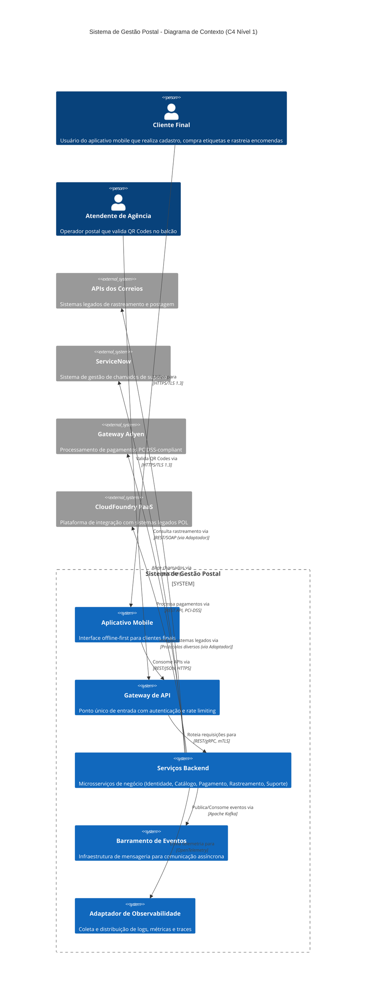

### 2. C4 Model - Nível 2: Diagrama de Containers

**Descrição**

Esta visão de containers detalha a arquitetura interna do sistema, mostrando os containers lógicos independentes e suas interações. Cada container representa uma unidade executável ou armazenamento de dados com responsabilidade única.

**Containers Principais**

| Container                   | Tipo           | Responsabilidade                               | Tecnologia Recomendada              |
| --------------------------- | -------------- | ---------------------------------------------- | ----------------------------------- |
| Aplicativo Mobile           | Mobile App     | Interface offline-first, cache local, QR Codes | React Native                        |
| API Gateway                 | Gateway        | Roteamento, autenticação, rate limiting        | Kong Gateway                        |
| Serviço de Identidade       | Backend        | Gestão de contas, LGPD, consentimentos         | Spring Boot + Keycloak              |
| Serviço de Catálogo         | Backend        | Geolocalização de agências, busca textual      | Spring Boot + Elasticsearch         |
| Serviço de Compra/Pagamento | Backend        | Orquestração de compras, QR Codes, PCIDSS      | Spring Boot + Adyen SDK             |
| Serviço de Rastreamento     | Backend        | Consumo de eventos externos, cache de status   | Spring Boot                         |
| Serviço de Suporte          | Backend        | Gestão de chamados, notificações               | Spring Boot                         |
| Adaptador CloudFoundry      | Backend        | Isolamento de sistemas legados                 | Spring Cloud Gateway + Resilience4j |
| Barramento de Eventos       | Infrastructure | Mensageria distribuída, ordenação              | Apache Kafka                        |
| PostgreSQL                  | Database       | Persistência transacional ACID                 | PostgreSQL 15+ TDE                  |
| Redis                       | Database       | Cache distribuído, sessões                     | Redis Cluster                       |
| OpenTelemetry Collector     | Infrastructure | Agregação de telemetria                        | OpenTelemetry Collector             |

```mermaid
C4Container
    title Sistema de Gestão Postal - Diagrama de Containers (C4 Nível 2)

    Person(cliente, "Cliente Final", "Usuário do aplicativo mobile")
    Person(atendente, "Atendente de Agência", "Operador de balcão")

    Container_Boundary(mobile, "Camada de Apresentação") {
        Container(app_mobile, "Aplicativo Mobile", "React Native", "Interface offline-first, cache local SQLite, renderização de QR Codes, acessibilidade WCAG 2.1")
    }

    Container_Boundary(gateway, "Camada de Edge") {
        Container(api_gateway, "API Gateway", "Kong Gateway", "Roteamento, autenticação OIDC/OAuth2, rate limiting, transformação de protocolos")
    }

    Container_Boundary(backend, "Camada de Serviços (Microsserviços)") {
        Container(svc_identidade, "Serviço de Identidade", "Spring Boot", "Gestão de contas, autenticação, autorização, consentimentos LGPD, criptografia de dados sensíveis")
        Container(svc_catalogo, "Serviço de Catálogo", "Spring Boot", "Gestão de agências, cálculo de proximidade geográfica, indexação para busca")
        Container(svc_compra, "Serviço de Compra", "Spring Boot", "Orquestração de transações, geração/validação de QR Codes, histórico de compras")
        Container(svc_rastreamento, "Serviço de Rastreamento", "Spring Boot", "Consumo de eventos externos, cache de status, notificações de atualização")
        Container(svc_suporte, "Serviço de Suporte", "Spring Boot", "Gestão de formulários, integração ServiceNow, envio de notificações")
        Container(adapter_cf, "Adaptador CloudFoundry", "Spring Cloud Gateway", "Anti-Corruption Layer para sistemas legados, Circuit Breaker, Retry, Fallback")
        Container(adapter_obs, "Adaptador Observabilidade", "OpenTelemetry Collector", "Coleta e normalização de logs, métricas e traces para múltiplos destinos")
    }

    Container_Boundary(messaging, "Camada de Mensageria") {
        Container(kafka, "Barramento de Eventos", "Apache Kafka", "Mensageria distribuída, garantia de entrega, ordenação de eventos, padrão Saga")
    }

    Container_Boundary(data, "Camada de Dados") {
        ContainerDb(postgres, "PostgreSQL", "PostgreSQL 15+ TDE", "Dados transacionais ACID, criptografia em repouso, conformidade LGPD")
        ContainerDb(redis, "Redis", "Redis Cluster", "Cache distribuído, sessões, dados de referência, baixa latência")
        ContainerDb(elasticsearch, "Elasticsearch", "Elasticsearch", "Indexação geoespacial e busca textual de agências")
    }

    Container_Ext(adyen, "Gateway Adyen", "Serviço Externo", "Processamento de pagamentos PCIDSS-compliant")
    Container_Ext(servicenow, "ServiceNow", "Serviço Externo", "Gestão de chamados de suporte")
    Container_Ext(correios, "APIs Correios", "Sistema Legado", "Rastreamento e postagem via CloudFoundry")

    Rel(cliente, app_mobile, "Interage via", "HTTPS/TLS 1.3")
    Rel(atendente, api_gateway, "Valida QR Code via", "HTTPS/TLS 1.3 (mTLS opcional)")
    
    Rel(app_mobile, api_gateway, "Consome APIs REST", "JSON/HTTPS, JWT")
    Rel(api_gateway, svc_identidade, "Autentica/Autoriza", "REST/gRPC, mTLS")
    Rel(api_gateway, svc_catalogo, "Consulta agências", "REST/gRPC, mTLS")
    Rel(api_gateway, svc_compra, "Processa compras", "REST/gRPC, mTLS")
    Rel(api_gateway, svc_rastreamento, "Consulta rastreamento", "REST/gRPC, mTLS")
    Rel(api_gateway, svc_suporte, "Abre chamados", "REST/gRPC, mTLS")
    
    Rel(svc_identidade, postgres, "Persiste dados de conta", "JDBC/TLS")
    Rel(svc_identidade, redis, "Cache de sessões", "Redis Protocol/TLS")
    
    Rel(svc_catalogo, elasticsearch, "Indexa e busca agências", "HTTP/TLS")
    Rel(svc_catalogo, redis, "Cache de dados de referência", "Redis Protocol/TLS")
    Rel(svc_catalogo, postgres, "Dados mestre de agências", "JDBC/TLS")
    
    Rel(svc_compra, postgres, "Persiste transações", "JDBC/TLS")
    Rel(svc_compra, kafka, "Publica eventos de compra", "Kafka Protocol/TLS")
    Rel(svc_compra, adyen, "Processa pagamentos", "REST API/TLS (PCIDSS)")
    Rel(svc_compra, redis, "Cache de QR Codes ativos", "Redis Protocol/TLS")
    
    Rel(svc_rastreamento, kafka, "Consome eventos de compra", "Kafka Protocol/TLS")
    Rel(svc_rastreamento, adapter_cf, "Consulta APIs Correios", "REST/gRPC, mTLS")
    Rel(svc_rastreamento, redis, "Cache de status", "Redis Protocol/TLS")
    Rel(svc_rastreamento, postgres, "Histórico de movimentações", "JDBC/TLS")
    
    Rel(svc_suporte, postgres, "Registra chamados", "JDBC/TLS")
    Rel(svc_suporte, servicenow, "Integra chamados", "REST API/TLS")
    Rel(svc_suporte, kafka, "Publica eventos de notificação", "Kafka Protocol/TLS")
    
    Rel(adapter_cf, correios, "Integra sistemas legados", "Protocolos diversos/TLS")
    
    Rel(svc_identidade, adapter_obs, "Envia logs/métricas", "OpenTelemetry Protocol")
    Rel(svc_catalogo, adapter_obs, "Envia logs/métricas", "OpenTelemetry Protocol")
    Rel(svc_compra, adapter_obs, "Envia logs/métricas", "OpenTelemetry Protocol")
    Rel(svc_rastreamento, adapter_obs, "Envia logs/métricas", "OpenTelemetry Protocol")
    Rel(svc_suporte, adapter_obs, "Envia logs/métricas", "OpenTelemetry Protocol")
    Rel(adapter_cf, adapter_obs, "Envia logs/métricas", "OpenTelemetry Protocol")
    
    UpdateLayoutConfig($c4ShapeInRow="3", $c4BoundaryInRow="2")
```

### 3. C4 Model - Nível 3: Diagrama de Componentes
#### 3.1 Serviço de Identidade e Acesso

Este serviço gerencia o ciclo de vida completo de contas de usuário, implementando requisitos críticos de LGPD (consentimentos, anonimização) e segurança (criptografia end-to-end).

```mermaid
C4Component
    title Serviço de Identidade e Acesso - Diagrama de Componentes (C4 Nível 3)

    Container_Boundary(svc_identidade, "Serviço de Identidade e Acesso") {
        Component(api_controller, "API Controller", "Spring REST Controller", "Expõe endpoints REST para cadastro, autenticação e gestão de perfil")
        Component(auth_service, "Auth Service", "Spring Service", "Lógica de autenticação, geração de tokens JWT, refresh tokens")
        Component(identity_service, "Identity Service", "Spring Service", "Gestão do ciclo de vida de contas, validação de unicidade")
        Component(consent_service, "Consent Service", "Spring Service", "Gestão de consentimentos LGPD, preferências de marketing, revogação")
        Component(crypto_service, "Crypto Service", "Spring Service", "Criptografia de dados sensíveis em trânsito e repouso (AES-256-GCM)")
        Component(audit_service, "Audit Service", "Spring Service", "Geração de trilhas de auditoria para compliance LGPD/PCIDSS")
        
        Component(keycloak_adapter, "Keycloak Adapter", "Keycloak Spring Adapter", "Integração com Keycloak para OIDC/OAuth2 e federacao de identidades")
        
        Component(identity_repo, "Identity Repository", "Spring Data JPA", "Acesso a dados de contas e perfis")
        Component(consent_repo, "Consent Repository", "Spring Data JPA", "Acesso a histórico de consentimentos")
        Component(audit_repo, "Audit Repository", "Spring Data JPA", "Persistência de logs de auditoria")
    }
    
    ContainerDb(postgres, "PostgreSQL", "PostgreSQL 15+ TDE", "Dados criptografados de contas e auditoria")
    Container(redis, "Redis", "Redis Cluster", "Cache de sessões ativas e tokens")
    Container(api_gateway, "API Gateway", "Kong Gateway", "Roteamento e validação inicial de tokens")
    Container(adapter_obs, "Adaptador Observabilidade", "OpenTelemetry", "Coleta de telemetria")
    Container(keycloak, "Keycloak", "Keycloak Server", "Servidor de identidade OIDC/OAuth2")

    Rel(api_gateway, api_controller, "Roteia requisições autenticadas", "REST/JSON, mTLS")
    
    Rel(api_controller, auth_service, "Delega autenticação", "Spring Bean")
    Rel(api_controller, identity_service, "Delega gestão de contas", "Spring Bean")
    Rel(api_controller, consent_service, "Delega gestão de consentimentos", "Spring Bean")
    
    Rel(auth_service, keycloak_adapter, "Valida tokens e sessões", "OIDC/OAuth2")
    Rel(auth_service, crypto_service, "Criptografa credenciais", "AES-256-GCM")
    Rel(auth_service, redis, "Gerencia sessões", "Redis Protocol/TLS")
    
    Rel(identity_service, identity_repo, "Persiste dados de conta", "JPA/Hibernate")
    Rel(identity_service, crypto_service, "Criptografa PII", "AES-256-GCM")
    Rel(identity_service, audit_service, "Registra operações", "Spring Event")
    
    Rel(consent_service, consent_repo, "Persiste consentimentos", "JPA/Hibernate")
    Rel(consent_service, audit_service, "Registra alterações LGPD", "Spring Event")
    
    Rel(audit_service, audit_repo, "Persiste trilhas", "JPA/Hibernate")
    Rel(audit_service, adapter_obs, "Envia métricas de segurança", "OpenTelemetry SDK")
    
    Rel(keycloak_adapter, keycloak, "Federacao de identidades", "HTTPS/OIDC")
    
    Rel(identity_repo, postgres, "Acesso a dados", "JDBC/TLS")
    Rel(consent_repo, postgres, "Acesso a dados", "JDBC/TLS")
    Rel(audit_repo, postgres, "Acesso a dados", "JDBC/TLS")
    
    UpdateLayoutConfig($c4ShapeInRow="3", $c4BoundaryInRow="1")
```

#### 3.2 Serviço de Compra e Pagamento

Este serviço é crítico para o negócio, implementando orquestração de transações com conformidade PCIDSS, geração de QR Codes e integração com gateway de pagamentos. Adota padrão Saga para consistência distribuída.

```mermaid
C4Component
    title Serviço de Compra e Pagamento - Diagrama de Componentes (C4 Nível 3)

    Container_Boundary(svc_compra, "Serviço de Compra e Pagamento") {
        Component(api_controller, "API Controller", "Spring REST Controller", "Endpoints para criação de compras, consulta de histórico, validação de QR Code")
        Component(compra_orquestrador, "Orquestrador de Compra", "Spring Service", "Coordena fluxo de compra: seleção, pagamento, geração QR, confirmação (padrão Saga)")
        Component(pagamento_service, "Pagamento Service", "Spring Service", "Integração com gateway Adyen, tokenização de cartões, conformidade PCIDSS")
        Component(qr_service, "QR Code Service", "Spring Service", "Geração e validação de QR Codes únicos, criptografia de payload")
        Component(saga_coordinator, "Saga Coordinator", "Spring State Machine", "Gerencia estado de transações distribuídas, compensações em caso de falha")
        Component(cache_service, "Cache Service", "Spring Service", "Cache de QR Codes ativos e status de transações pendentes")
        
        Component(compra_repo, "Compra Repository", "Spring Data JPA", "Persistência de transações e histórico")
        Component(saga_repo, "Saga Repository", "Spring Data JPA", "Persistência de estado de Sagas")
        Component(event_publisher, "Event Publisher", "Spring Kafka Template", "Publicação de eventos de domínio (CompraCriada, PagamentoConfirmado, QRCodeGerado)")
    }
    
    ContainerDb(postgres, "PostgreSQL", "PostgreSQL 15+ TDE", "Dados transacionais ACID, criptografados")
    Container(redis, "Redis", "Redis Cluster", "Cache de transações pendentes e QR Codes")
    Container(kafka, "Barramento de Eventos", "Apache Kafka", "Eventos de domínio para outros serviços")
    Container(adyen, "Gateway Adyen", "Serviço Externo", "Processamento PCIDSS-compliant")
    Container(adapter_obs, "Adaptador Observabilidade", "OpenTelemetry", "Telemetria de transações financeiras")
    Container(api_gateway, "API Gateway", "Kong Gateway", "Roteamento e segurança")

    Rel(api_gateway, api_controller, "Roteia requisições", "REST/JSON, mTLS, JWT")
    
    Rel(api_controller, compra_orquestrador, "Inicia/Consulta compras", "Spring Bean")
    Rel(api_controller, qr_service, "Valida QR Codes (atendentes)", "Spring Bean")
    
    Rel(compra_orquestrador, pagamento_service, "Processa pagamento", "Spring Bean")
    Rel(compra_orquestrador, qr_service, "Gera QR Code pós-pagamento", "Spring Bean")
    Rel(compra_orquestrador, saga_coordinator, "Coordena transação", "Spring State Machine")
    Rel(compra_orquestrador, event_publisher, "Publica eventos", "Spring Event")
    Rel(compra_orquestrador, cache_service, "Cache de status", "Spring Bean")
    
    Rel(pagamento_service, adyen, "Processa transação", "REST API/TLS (PCIDSS)")
    Rel(pagamento_service, adapter_obs, "Audita transações", "OpenTelemetry SDK")
    
    Rel(saga_coordinator, saga_repo, "Persiste estado", "JPA/Hibernate")
    Rel(saga_coordinator, event_publisher, "Publica eventos de Saga", "Spring Event")
    
    Rel(event_publisher, kafka, "Publica eventos de domínio", "Kafka Protocol/TLS")
    
    Rel(cache_service, redis, "Cache distribuído", "Redis Protocol/TLS")
    
    Rel(compra_repo, postgres, "Persiste transações", "JDBC/TLS")
    Rel(saga_repo, postgres, "Persiste estados", "JDBC/TLS")
    
    UpdateLayoutConfig($c4ShapeInRow="3", $c4BoundaryInRow="1")
```

### 4. Diagramas de Sequência - Fluxos Principais

#### 4.1 Fluxo de Criação de Conta (INC-001)

Este fluxo representa o cadastro inicial do cliente, incluindo validação de dados, criptografia de informações sensíveis e conformidade com LGPD.

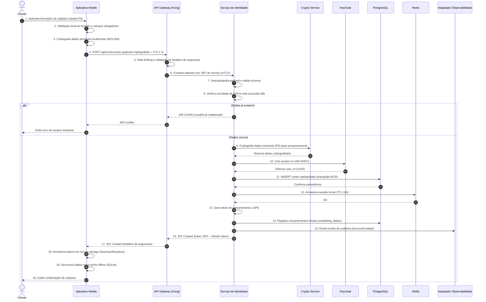

#### 4.2 Fluxo de Localização de Agências (INC-002)

Fluxo de busca por agências próximas utilizando geolocalização do dispositivo, com cache offline e cálculo de proximidade.

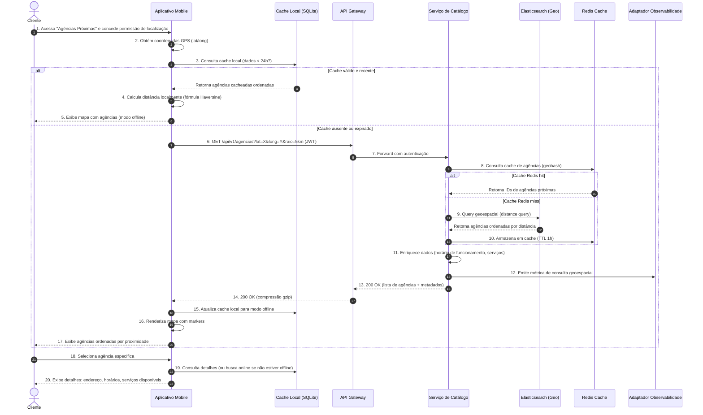

#### 4.3 Fluxo de Compra de Etiqueta com QR Code (INC-003)

Fluxo crítico de compra implementando padrão Saga para orquestração distribuída, PCIDSS para pagamentos e geração de QR Codes.

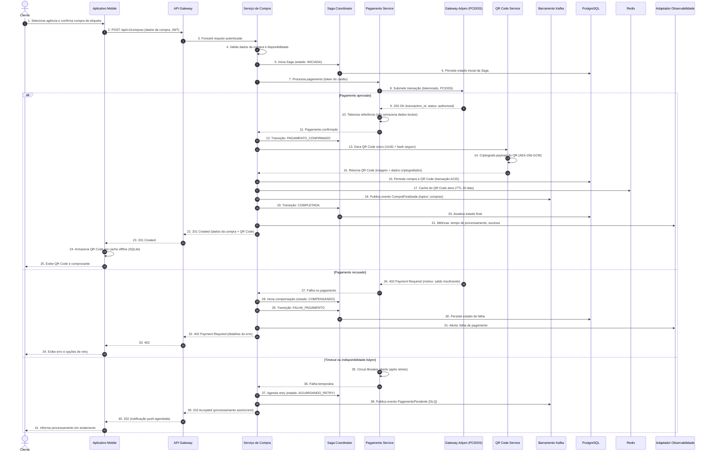

#### 4.4 Fluxo de Rastreamento de Encomendas (INC-004)

Fluxo de consulta de status de encomendas com cache agressivo e integração assíncrona com APIs externas dos Correios via Adaptador Anti-Corruption.

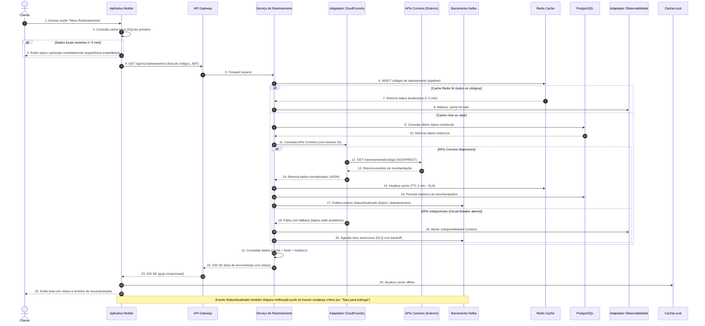

### 5. Diagrama de Eventos - Arquitetura Orientada a Eventos

**Eventos de Domínio**

| Evento                         | Produtor                    | Consumidores                          | Descrição                                | Incremento       |
| ------------------------------ | --------------------------- | ------------------------------------- | ---------------------------------------- | ---------------- |
| `ContaCriada`                  | Serviço de Identidade       | Serviço de Suporte, Observabilidade   | Nova conta de cliente criada com sucesso | INC-001          |
| `ConsentimentoAtualizado`      | Serviço de Identidade       | Serviço de Suporte, Banco de Dados    | Alteração em preferências LGPD           | INC-001          |
| `CompraIniciada`               | Serviço de Compra           | Saga Coordinator, Observabilidade     | Início de processo de compra             | INC-003          |
| `PagamentoConfirmado`          | Gateway Adyen (via Adapter) | Serviço de Compra, Saga Coordinator   | Confirmação de transação financeira      | INC-003          |
| `PagamentoRecusado`            | Gateway Adyen (via Adapter) | Serviço de Compra, Saga Coordinator   | Falha no processamento de pagamento      | INC-003          |
| `QRCodeGerado`                 | Serviço de Compra           | Serviço de Rastreamento, Cache        | Geração de código para postagem          | INC-003          |
| `CompraFinalizada`             | Serviço de Compra           | Serviço de Rastreamento, Notificações | Compra completa com sucesso              | INC-003          |
| `StatusRastreamentoAtualizado` | Adaptador CloudFoundry      | Serviço de Rastreamento, Notificações | Nova movimentação de encomenda           | INC-004          |
| `ChamadoAberto`                | Serviço de Suporte          | ServiceNow, Observabilidade           | Novo ticket de suporte criado            | INC-005          |
| `NotificacaoEnviada`           | Serviço de Suporte          | Cliente (push/email)                  | Confirmação de ação                      | INC-002, INC-005 |

**Topologia do Barramento**

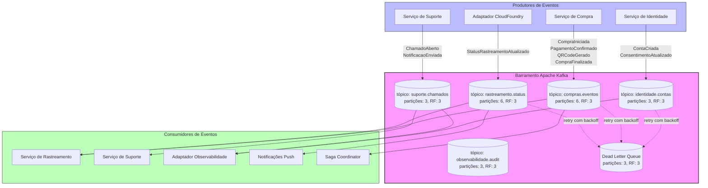

### 6. Architecture Decision Records (ADRs)
#### ADR-001: Arquitetura Offline-First para Aplicativo Mobile
**Status**: Aceito

**Contexto**: O aplicativo deve operar em modo offline-first conforme constraint obrigatório, permitindo acesso a QR Codes e histórico de rastreamento sem conectividade.

**Decisão**: Adotar arquitetura com cache local robusto no aplicativo mobile (SQLite criptografado), sincronização assíncrona e estratégia de resolução de conflitos baseada em timestamp/versão (Last-Write-Wins com vetores de versão).

**Consequências**:
 - ✅ Positivo: Melhor experiência do usuário, conformidade com constraint, resiliência a falhas de rede
 - ⚠️ Negativo: Complexidade adicional em sincronização, possibilidade de conflitos de dados, maior uso de armazenamento local

#### ADR-002: Modelo de Dados Unificado com Eventos para Compras e Rastreamento
**Status**: Aceito

**Contexto**: Múltiplos serviços precisam acessar dados de transações (compras) e rastreamento, com necessidade de consistência e rastreabilidade.

**Decisão**: Estabelecer modelo de dados unificado para transações compartilhado entre Serviço de Compra e Serviço de Rastreamento, com comunicação assíncrona via Apache Kafka e padrão Saga para consistência distribuída.

**Consequências**:
 - ✅ Positivo: Consistência de dados, reuso de informações, desacoplamento de serviços
 - ⚠️ Negativo: Complexidade de orquestração de eventos, necessidade de garantia de entrega e ordenação
 - 🔴 Risco: Latência na propagação de eventos pode causar inconsistência temporária entre compra e rastreamento

#### ADR-003: Anti-Corruption Layer para Integrações Legadas
**Status**: Aceito

**Contexto**: Integração obrigatória com sistemas legados via CloudFoundry PaaS e APIs externas dos Correios, com diferentes protocolos e níveis de confiabilidade.

**Decisão**: Implementar camada de adaptadores dedicada (Spring Cloud Gateway + Resilience4j) para isolamento de sistemas externos, com padrões Circuit Breaker, Retry e Fallback.

**Consequências**:
 - ✅ Positivo: Resiliência a falhas de sistemas externos, testabilidade, isolamento de complexidade legada
 - ⚠️ Negativo: Overhead de manutenção de adaptadores, latência adicional nas chamadas
 - 🔴 Risco: Configuração incorreta de circuit breaker pode causar negação de serviço desnecessária

#### ADR-004: Segurança em Camadas para PCIDSS e LGPD
**Status**: Aceito

**Contexto**: Requisitos de segurança exigem conformidade com PCIDSS para pagamentos, LGPD/GDPR para dados pessoais, e integração com SOC para monitoramento.

**Decisão**: Adotar arquitetura de segurança em camadas com criptografia end-to-end (AES-256-GCM), tokenização de dados de pagamento via Adyen, auditoria centralizada via PostgreSQL TDE, e segregação de ambientes.

**Consequências**:
 - ✅ Positivo: Conformidade regulatória, proteção de dados sensíveis, visibilidade de segurança
 - ⚠️ Negativo: Complexidade de implementação, impacto em performance, necessidade de certificações
 - 🔴 Risco: Atrasos em auditorias PCIDSS podem bloquear release de funcionalidade core (INC-003)

#### ADR-005: Observabilidade Unificada via OpenTelemetry
**Status**: Aceito

**Contexto**: Necessidade de integração com múltiplas ferramentas de observabilidade (CloudWatch, App Dynamics, Datadog, Wiz) e ServiceNow para alertas.

**Decisão**: Implementar adaptador unificado de observabilidade (OpenTelemetry Collector) que normaliza e distribui métricas, logs e traces para consumidores heterogêneos.

**Consequências**:
 - ✅ Positivo: Desacoplamento de ferramentas específicas, padronização de observabilidade, facilidade de substituição de ferramentas
 - ⚠️ Negativo: Ponto único de falha potencial, necessidade de alta disponibilidade do próprio adaptador
 - 🔴 Risco: Normalização inadequada pode causar perda de informações específicas de cada ferramenta

### 7. Stack Tecnológica Recomendada

**Resumo da Stack Primária**

| Categoria                | Tecnologia Primária                 | Alternativa Viável   | Justificativa                                                                                                                           |
| ------------------------ | ----------------------------------- | -------------------- | --------------------------------------------------------------------------------------------------------------------------------------- |
| **Front-end Mobile**     | React Native                        | Flutter              | Ampla base de desenvolvedores, suporte sólido a acessibilidade (WCAG 2.1/ABNT NBR 17060) e bibliotecas maduras para cache offline-first |
| **API Gateway**          | Kong Gateway (OSS/Enterprise)       | AWS API Gateway      | Independência de nuvem, flexibilidade e suporte robusto a autenticação segura com baixo lock-in                                         |
| **Backend Transacional** | Spring Boot                         | .NET Core, NestJS    | Capacidade comprovada para compliance empresarial (PCIDSS, LGPD), amplo suporte a microsserviços e mensageria                           |
| **Identidade & Acesso**  | Keycloak                            | Auth0                | Solução open source consolidada, compatível com OIDC/OAuth2, evita lock-in e custos excessivos em volumes altos                         |
| **Geoprocessamento**     | Elasticsearch (geospatial)          | PostGIS              | Alinha busca textual eficiente à necessidade de cálculos geoespaciais em alta escala                                                    |
| **Pagamentos**           | Adyen                               | Pagar.me             | Conformidade PCIDSS/PCI pronta para produção, suporte robusto à geração e consulta de QR Codes                                          |
| **Mensageria**           | Apache Kafka                        | RabbitMQ             | Garantia de ordenação, desacoplamento e suporte ao padrão Saga para transações distribuídas                                             |
| **Observabilidade**      | OpenTelemetry Collector             | Fluentd + Prometheus | Neutralidade de vendor, coleta unificada de logs/métricas/traces para múltiplos destinos                                                |
| **Adaptadores**          | Spring Cloud Gateway + Resilience4j | Node.js + Polly.js   | Padrões resilientes necessários com fácil integração ao ecossistema Java/Spring                                                         |
| **Banco Transacional**   | PostgreSQL 15+ (TDE)                | MySQL 8+ (TDE)       | Compliant nativo LGPD/PCIDSS, ACID, integração ágil com Spring                                                                          |
| **Cache Distribuído**    | Redis Cluster                       | Memcached            | Baixa latência, suporte a estruturas complexas, alta disponibilidade                                                                    |

**Matriz de Conformidade**

| Requisito                            | PostgreSQL TDE | Redis         | Kafka        | Keycloak | Adyen         | OpenTelemetry |
| ------------------------------------ | -------------- | ------------- | ------------ | -------- | ------------- | ------------- |
| **LGPD - Criptografia em repouso**   | ✅ Sim          | ⚠️ TLS + ACL  | ✅ TLS        | ✅ Sim    | ✅ Sim         | ✅ TLS         |
| **LGPD - Auditoria de acesso**       | ✅ Sim          | ⚠️ Logs       | ✅ Sim        | ✅ Sim    | ✅ Sim         | ✅ Sim         |
| **LGPD - Anonimização**              | ✅ Sim          | ❌ Não aplica  | ❌ Não aplica | ✅ Sim    | ✅ Tokenização | ❌ Não aplica  |
| **PCIDSS - Criptografia de dados**   | ✅ AES-256      | ⚠️ TLS apenas | ✅ TLS        | ✅ Sim    | ✅ Sim         | ✅ TLS         |
| **PCIDSS - Isolamento de rede**      | ✅ mTLS         | ✅ mTLS        | ✅ mTLS       | ✅ Sim    | ✅ Sim         | ✅ mTLS        |
| **PCIDSS - Monitoramento de acesso** | ✅ Sim          | ✅ Sim         | ✅ Sim        | ✅ Sim    | ✅ Sim         | ✅ Sim         |


### 8. Diagrama de Deploy (Visão de Infraestrutura Lógica)

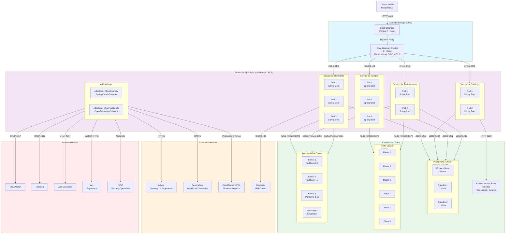

#### 9. Pontos de Atenção e Riscos Arquiteturais

**Riscos Críticos**

| Risco                                  | Probabilidade | Impacto | Mitigação                                                                                                 |
| -------------------------------------- | ------------- | ------- | --------------------------------------------------------------------------------------------------------- |
| **Certificação PCIDSS bloqueante**     | Média         | Alto    | Iniciar auditoria paralela ao desenvolvimento; contratar consultoria especializada desde INC-001          |
| **Indisponibilidade APIs Correios**    | Alta          | Médio   | Cache agressivo (TTL 5 min); Circuit Breaker; fila de retry; dados stale aceitáveis                       |
| **Conflitos de sincronização offline** | Média         | Médio   | Definir device primário; estratégia Last-Write-Wins; logging de conflitos; resolução manual em edge cases |
| **Sobrecarga operacional da stack**    | Média         | Alto    | Priorizar serviços gerenciados (RDS, ElastiCache, MSK); automação de deploy; runbooks detalhados          |
| **Latência de geolocalização**         | Baixa         | Médio   | Pré-cálculo de distâncias em batch; índices geoespaciais no Elasticsearch; cache em múltiplas camadas     |

**Itens Não Deferríveis (Must Have para MVP)**
 - ✅ Arquitetura de segurança e conformidade PCIDSS/LGPD (INC-001)
 - ✅ Estratégia de cache offline-first (INC-002)
 - ✅ Contratos de API com sistemas legados via CloudFoundry (INC-003)
 - ✅ Modelo de dados unificado entre compras e rastreamento (INC-003)
 - ✅ Integração com SOC e ServiceNow (INC-003)

#### 10. Considerações de Evolução
**Fase 1: MVP (Incrementos INC-001 a INC-003)**
 - Estabilização da arquitetura base (React Native, Spring Boot, PostgreSQL, Redis, Kafka)
 - Implementação dos fluxos críticos: identidade, catálogo, compra com QR Code
 - Estabelecimento de padrões de observabilidade e segurança

**Fase 2: Expansão (INC-004 e INC-005)**
 - Integração de rastreamento em tempo real com cache otimizado
 - Sistema de suporte integrado com ServiceNow
 - Otimizações de performance em busca geoespacial (se volume justificar)

**Fase 3: Otimização e Inovação**
 - Analytics avançado de comportamento do usuário
 - Automação de respostas de suporte com IA (conforme premissas de consultoria)
 - Expansão para novos canais (WhatsApp, Chat)
 - Avaliação de migração para arquitetura serverless em componentes não críticos

## Implementação Prática

# Backend Repository

## Estrutura do Projeto

```plain
correios-backend/
├── docker-compose.yml
├── Makefile
├── README.md
├── .env.example
├── infrastructure/
│   ├── kong/
│   │   ├── kong.yml
│   │   └── Dockerfile
│   ├── keycloak/
│   │   └── realm-export.json
│   └── observability/
│       ├── otel-collector-config.yml
│       ├── prometheus.yml
│       └── grafana-dashboards/
├── services/
│   ├── identity-service/
│   ├── catalog-service/
│   ├── purchase-service/
│   ├── tracking-service/
│   ├── support-service/
│   └── adapter-cloudfoundry/
└── shared/
├── domain/
├── events/
└── security/
```


## 1. Docker Compose - Infraestrutura Completa

```yaml
# docker-compose.yml
version: '3.8'

services:
  # PostgreSQL - Banco Transacional
  postgres:
    image: postgres:15-alpine
    container_name: correios-postgres
    environment:
      POSTGRES_USER: ${DB_USER:-correios}
      POSTGRES_PASSWORD: ${DB_PASSWORD:-correios123}
      POSTGRES_DB: ${DB_NAME:-correios_db}
      POSTGRES_INITDB_ARGS: "--encoding=UTF-8 --locale=pt_BR.UTF-8"
    volumes:
      - postgres_data:/var/lib/postgresql/data
      - ./infrastructure/postgres/init:/docker-entrypoint-initdb.d
    ports:
      - "5432:5432"
    healthcheck:
      test: ["CMD-SHELL", "pg_isready -U ${DB_USER:-correios}"]
      interval: 10s
      timeout: 5s
      retries: 5
    networks:
      - correios-network

  # Redis - Cache Distribuído
  redis:
    image: redis:7-alpine
    container_name: correios-redis
    command: redis-server --requirepass ${REDIS_PASSWORD:-redis123} --appendonly yes
    volumes:
      - redis_data:/data
    ports:
      - "6379:6379"
    healthcheck:
      test: ["CMD", "redis-cli", "ping"]
      interval: 10s
      timeout: 3s
      retries: 5
    networks:
      - correios-network

  # Apache Kafka - Barramento de Eventos
  zookeeper:
    image: confluentinc/cp-zookeeper:7.5.0
    container_name: correios-zookeeper
    environment:
      ZOOKEEPER_CLIENT_PORT: 2181
      ZOOKEEPER_TICK_TIME: 2000
    networks:
      - correios-network

  kafka:
    image: confluentinc/cp-kafka:7.5.0
    container_name: correios-kafka
    depends_on:
      - zookeeper
    ports:
      - "9092:9092"
      - "29092:29092"
    environment:
      KAFKA_BROKER_ID: 1
      KAFKA_ZOOKEEPER_CONNECT: zookeeper:2181
      KAFKA_ADVERTISED_LISTENERS: PLAINTEXT://kafka:29092,PLAINTEXT_HOST://localhost:9092
      KAFKA_LISTENER_SECURITY_PROTOCOL_MAP: PLAINTEXT:PLAINTEXT,PLAINTEXT_HOST:PLAINTEXT
      KAFKA_INTER_BROKER_LISTENER_NAME: PLAINTEXT
      KAFKA_OFFSETS_TOPIC_REPLICATION_FACTOR: 1
      KAFKA_AUTO_CREATE_TOPICS_ENABLE: "true"
    healthcheck:
      test: ["CMD", "kafka-broker-api-versions", "--bootstrap-server", "localhost:9092"]
      interval: 10s
      timeout: 5s
      retries: 5
    networks:
      - correios-network

  kafka-ui:
    image: provectuslabs/kafka-ui:latest
    container_name: correios-kafka-ui
    ports:
      - "8080:8080"
    environment:
      KAFKA_CLUSTERS_0_NAME: local
      KAFKA_CLUSTERS_0_BOOTSTRAPSERVERS: kafka:29092
      KAFKA_CLUSTERS_0_ZOOKEEPER: zookeeper:2181
    depends_on:
      - kafka
    networks:
      - correios-network

  # Keycloak - Identidade e Acesso
  keycloak:
    image: quay.io/keycloak/keycloak:22.0.5
    container_name: correios-keycloak
    command: start-dev --import-realm
    environment:
      KEYCLOAK_ADMIN: ${KEYCLOAK_ADMIN:-admin}
      KEYCLOAK_ADMIN_PASSWORD: ${KEYCLOAK_ADMIN_PASSWORD:-admin123}
      KC_DB: postgres
      KC_DB_URL: jdbc:postgresql://postgres:5432/keycloak
      KC_DB_USERNAME: ${DB_USER:-correios}
      KC_DB_PASSWORD: ${DB_PASSWORD:-correios123}
    volumes:
      - ./infrastructure/keycloak/realm-export.json:/opt/keycloak/data/import/realm.json
    ports:
      - "8180:8080"
    depends_on:
      postgres:
        condition: service_healthy
    networks:
      - correios-network

  # Kong Gateway - API Gateway
  kong:
    build: ./infrastructure/kong
    container_name: correios-kong
    environment:
      KONG_DATABASE: postgres
      KONG_PG_HOST: postgres
      KONG_PG_USER: ${DB_USER:-correios}
      KONG_PG_PASSWORD: ${DB_PASSWORD:-correios123}
      KONG_PG_DATABASE: kong
      KONG_PROXY_ACCESS_LOG: /dev/stdout
      KONG_ADMIN_ACCESS_LOG: /dev/stdout
      KONG_PROXY_ERROR_LOG: /dev/stderr
      KONG_ADMIN_ERROR_LOG: /dev/stderr
      KONG_PLUGINS: bundled,jwt,key-auth,rate-limiting,cors,oidc
    ports:
      - "8000:8000"
      - "8443:8443"
      - "8001:8001"
      - "8444:8444"
    depends_on:
      postgres:
        condition: service_healthy
    networks:
      - correios-network

  # OpenTelemetry Collector - Observabilidade
  otel-collector:
    image: otel/opentelemetry-collector-contrib:0.88.0
    container_name: correios-otel
    command: ["--config=/etc/otel-collector-config.yml"]
    volumes:
      - ./infrastructure/observability/otel-collector-config.yml:/etc/otel-collector-config.yml
    ports:
      - "4317:4317"
      - "4318:4318"
      - "8888:8888"
      - "8889:8889"
    networks:
      - correios-network

  # Prometheus - Métricas
  prometheus:
    image: prom/prometheus:v2.47.0
    container_name: correios-prometheus
    volumes:
      - ./infrastructure/observability/prometheus.yml:/etc/prometheus/prometheus.yml
      - prometheus_data:/prometheus
    ports:
      - "9090:9090"
    networks:
      - correios-network

  # Grafana - Dashboards
  grafana:
    image: grafana/grafana:10.2.0
    container_name: correios-grafana
    environment:
      GF_SECURITY_ADMIN_USER: ${GRAFANA_USER:-admin}
      GF_SECURITY_ADMIN_PASSWORD: ${GRAFANA_PASSWORD:-admin123}
      GF_INSTALL_PLUGINS: grafana-clock-panel,grafana-simple-json-datasource
    volumes:
      - grafana_data:/var/lib/grafana
      - ./infrastructure/observability/grafana-dashboards:/etc/grafana/provisioning/dashboards
    ports:
      - "3000:3000"
    networks:
      - correios-network

  # Elasticsearch - Busca Geoespacial
  elasticsearch:
    image: docker.elastic.co/elasticsearch/elasticsearch:8.11.0
    container_name: correios-elasticsearch
    environment:
      - discovery.type=single-node
      - xpack.security.enabled=false
      - "ES_JAVA_OPTS=-Xms512m -Xmx512m"
    volumes:
      - elasticsearch_data:/usr/share/elasticsearch/data
    ports:
      - "9200:9200"
    networks:
      - correios-network

  # Serviço de Identidade
  identity-service:
    build: ./services/identity-service
    container_name: correios-identity-service
    environment:
      SPRING_PROFILES_ACTIVE: docker
      DB_HOST: postgres
      DB_PORT: 5432
      DB_NAME: identity_db
      DB_USER: ${DB_USER:-correios}
      DB_PASSWORD: ${DB_PASSWORD:-correios123}
      REDIS_HOST: redis
      REDIS_PORT: 6379
      REDIS_PASSWORD: ${REDIS_PASSWORD:-redis123}
      KEYCLOAK_URL: http://keycloak:8080
      KEYCLOAK_REALM: correios
      KAFKA_BOOTSTRAP_SERVERS: kafka:29092
      OTEL_EXPORTER_OTLP_ENDPOINT: http://otel-collector:4317
    ports:
      - "8081:8080"
    depends_on:
      postgres:
        condition: service_healthy
      redis:
        condition: service_healthy
      kafka:
        condition: service_healthy
      keycloak:
        condition: service_started
    networks:
      - correios-network

  # Serviço de Catálogo
  catalog-service:
    build: ./services/catalog-service
    container_name: correios-catalog-service
    environment:
      SPRING_PROFILES_ACTIVE: docker
      DB_HOST: postgres
      DB_PORT: 5432
      DB_NAME: catalog_db
      DB_USER: ${DB_USER:-correios}
      DB_PASSWORD: ${DB_PASSWORD:-correios123}
      REDIS_HOST: redis
      REDIS_PORT: 6379
      REDIS_PASSWORD: ${REDIS_PASSWORD:-redis123}
      ELASTICSEARCH_HOST: elasticsearch
      ELASTICSEARCH_PORT: 9200
      KAFKA_BOOTSTRAP_SERVERS: kafka:29092
      OTEL_EXPORTER_OTLP_ENDPOINT: http://otel-collector:4317
    ports:
      - "8082:8080"
    depends_on:
      postgres:
        condition: service_healthy
      redis:
        condition: service_healthy
      elasticsearch:
        condition: service_started
    networks:
      - correios-network

  # Serviço de Compra
  purchase-service:
    build: ./services/purchase-service
    container_name: correios-purchase-service
    environment:
      SPRING_PROFILES_ACTIVE: docker
      DB_HOST: postgres
      DB_PORT: 5432
      DB_NAME: purchase_db
      DB_USER: ${DB_USER:-correios}
      DB_PASSWORD: ${DB_PASSWORD:-correios123}
      REDIS_HOST: redis
      REDIS_PORT: 6379
      REDIS_PASSWORD: ${REDIS_PASSWORD:-redis123}
      KAFKA_BOOTSTRAP_SERVERS: kafka:29092
      ADYEN_API_KEY: ${ADYEN_API_KEY:-test_key}
      ADYEN_MERCHANT_ACCOUNT: ${ADYEN_MERCHANT_ACCOUNT:-TestMerchant}
      ADYEN_ENVIRONMENT: test
      OTEL_EXPORTER_OTLP_ENDPOINT: http://otel-collector:4317
    ports:
      - "8083:8080"
    depends_on:
      postgres:
        condition: service_healthy
      redis:
        condition: service_healthy
      kafka:
        condition: service_healthy
    networks:
      - correios-network

  # Serviço de Rastreamento
  tracking-service:
    build: ./services/tracking-service
    container_name: correios-tracking-service
    environment:
      SPRING_PROFILES_ACTIVE: docker
      DB_HOST: postgres
      DB_PORT: 5432
      DB_NAME: tracking_db
      DB_USER: ${DB_USER:-correios}
      DB_PASSWORD: ${DB_PASSWORD:-correios123}
      REDIS_HOST: redis
      REDIS_PORT: 6379
      REDIS_PASSWORD: ${REDIS_PASSWORD:-redis123}
      KAFKA_BOOTSTRAP_SERVERS: kafka:29092
      CLOUDFOUNDRY_ADAPTER_URL: http://adapter-cloudfoundry:8080
      OTEL_EXPORTER_OTLP_ENDPOINT: http://otel-collector:4317
    ports:
      - "8084:8080"
    depends_on:
      postgres:
        condition: service_healthy
      redis:
        condition: service_healthy
      kafka:
        condition: service_healthy
    networks:
      - correios-network

  # Serviço de Suporte
  support-service:
    build: ./services/support-service
    container_name: correios-support-service
    environment:
      SPRING_PROFILES_ACTIVE: docker
      DB_HOST: postgres
      DB_PORT: 5432
      DB_NAME: support_db
      DB_USER: ${DB_USER:-correios}
      DB_PASSWORD: ${DB_PASSWORD:-correios123}
      KAFKA_BOOTSTRAP_SERVERS: kafka:29092
      SERVICENOW_URL: ${SERVICENOW_URL:-https://dev.service-now.com}
      SERVICENOW_USERNAME: ${SERVICENOW_USERNAME:-admin}
      SERVICENOW_PASSWORD: ${SERVICENOW_PASSWORD:-admin}
      OTEL_EXPORTER_OTLP_ENDPOINT: http://otel-collector:4317
    ports:
      - "8085:8080"
    depends_on:
      postgres:
        condition: service_healthy
      kafka:
        condition: service_healthy
    networks:
      - correios-network

  # Adaptador CloudFoundry
  adapter-cloudfoundry:
    build: ./services/adapter-cloudfoundry
    container_name: correios-adapter-cf
    environment:
      SPRING_PROFILES_ACTIVE: docker
      CORREIOS_API_URL: ${CORREIOS_API_URL:-https://api.correios.com.br}
      CORREIOS_API_TOKEN: ${CORREIOS_API_TOKEN:-test_token}
      REDIS_HOST: redis
      REDIS_PORT: 6379
      REDIS_PASSWORD: ${REDIS_PASSWORD:-redis123}
      OTEL_EXPORTER_OTLP_ENDPOINT: http://otel-collector:4317
    ports:
      - "8086:8080"
    depends_on:
      redis:
        condition: service_healthy
    networks:
      - correios-network

volumes:
  postgres_data:
  redis_data:
  prometheus_data:
  grafana_data:
  elasticsearch_data:

networks:
  correios-network:
    driver: bridge
```

## 2. Serviço de Identidade (Spring Boot)
```java
// services/identity-service/src/main/java/com/correios/identity/IdentityServiceApplication.java

package com.correios.identity;

import org.springframework.boot.SpringApplication;
import org.springframework.boot.autoconfigure.SpringBootApplication;
import org.springframework.cache.annotation.EnableCaching;
import org.springframework.data.jpa.repository.config.EnableJpaAuditing;

@SpringBootApplication
@EnableJpaAuditing
@EnableCaching
public class IdentityServiceApplication {
    public static void main(String[] args) {
        SpringApplication.run(IdentityServiceApplication.class, args);
    }
}
``` 

```java
// services/identity-service/src/main/java/com/correios/identity/domain/model/User.java
package com.correios.identity.domain.model;

import jakarta.persistence.*;
import lombok.*;
import org.hibernate.annotations.CreationTimestamp;
import org.hibernate.annotations.UpdateTimestamp;
import org.hibernate.annotations.GenericGenerator;

import java.time.LocalDateTime;
import java.util.UUID;

@Entity
@Table(name = "users", indexes = {
    @Index(name = "idx_user_cpf", columnList = "cpf", unique = true),
    @Index(name = "idx_user_email", columnList = "email", unique = true)
})
@Data
@NoArgsConstructor
@AllArgsConstructor
@Builder
public class User {
    
    @Id
    @GeneratedValue(generator = "UUID")
    @GenericGenerator(name = "UUID", strategy = "org.hibernate.id.UUIDGenerator")
    private UUID id;
    
    @Column(nullable = false, length = 11)
    private String cpf;
    
    @Column(nullable = false)
    private String fullName;
    
    @Column(nullable = false)
    private String email;
    
    @Column(nullable = false)
    private String phone;
    
    @Column(nullable = false)
    private String encryptedPassword;
    
    @Column(nullable = false)
    private boolean marketingConsent;
    
    @Column(nullable = false)
    private boolean dataProcessingConsent;
    
    @Column(nullable = false)
    private boolean active = true;
    
    @CreationTimestamp
    private LocalDateTime createdAt;
    
    @UpdateTimestamp
    private LocalDateTime updatedAt;
    
    @Column
    private LocalDateTime lastLoginAt;
    
    @Version
    private Long version;
}
```

```java
// services/identity-service/src/main/java/com/correios/identity/domain/repository/UserRepository.java
package com.correios.identity.domain.repository;

import com.correios.identity.domain.model.User;
import org.springframework.data.jpa.repository.JpaRepository;
import org.springframework.data.jpa.repository.Query;
import org.springframework.stereotype.Repository;

import java.util.Optional;
import java.util.UUID;

@Repository
public interface UserRepository extends JpaRepository<User, UUID> {
    
    Optional<User> findByCpf(String cpf);
    
    Optional<User> findByEmail(String email);
    
    @Query("SELECT u FROM User u WHERE u.cpf = :cpf OR u.email = :email")
    Optional<User> findByCpfOrEmail(String cpf, String email);
    
    boolean existsByCpf(String cpf);
    
    boolean existsByEmail(String email);
}
```

```java
// services/identity-service/src/main/java/com/correios/identity/application/service/IdentityService.java
package com.correios.identity.application.service;

import com.correios.identity.application.dto.*;
import com.correios.identity.application.mapper.UserMapper;
import com.correios.identity.domain.model.User;
import com.correios.identity.domain.repository.UserRepository;
import com.correios.identity.infrastructure.security.CryptoService;
import com.correios.identity.infrastructure.security.JwtService;
import com.correios.identity.infrastructure.event.IdentityEventPublisher;
import lombok.RequiredArgsConstructor;
import lombok.extern.slf4j.Slf4j;
import org.springframework.data.redis.core.RedisTemplate;
import org.springframework.stereotype.Service;
import org.springframework.transaction.annotation.Transactional;

import java.time.Duration;
import java.util.UUID;

@Service
@RequiredArgsConstructor
@Slf4j
public class IdentityService {
    
    private final UserRepository userRepository;
    private final CryptoService cryptoService;
    private final JwtService jwtService;
    private final UserMapper userMapper;
    private final IdentityEventPublisher eventPublisher;
    private final RedisTemplate<String, Object> redisTemplate;
    
    private static final String USER_CACHE_PREFIX = "user:";
    private static final Duration CACHE_TTL = Duration.ofHours(24);
    
    @Transactional
    public UserResponseDTO createUser(CreateUserRequestDTO request) {
        log.info("Creating user with CPF: {}", maskCpf(request.getCpf()));
        
        // Validação de unicidade
        if (userRepository.existsByCpf(request.getCpf())) {
            throw new DuplicateResourceException("CPF já cadastrado");
        }
        if (userRepository.existsByEmail(request.getEmail())) {
            throw new DuplicateResourceException("E-mail já cadastrado");
        }
        
        // Criptografia de dados sensíveis
        String encryptedCpf = cryptoService.encrypt(request.getCpf());
        String encryptedPassword = cryptoService.hashPassword(request.getPassword());
        
        User user = User.builder()
                .cpf(encryptedCpf)
                .fullName(request.getFullName())
                .email(request.getEmail())
                .phone(cryptoService.encrypt(request.getPhone()))
                .encryptedPassword(encryptedPassword)
                .marketingConsent(request.isMarketingConsent())
                .dataProcessingConsent(request.isDataProcessingConsent())
                .build();
        
        User savedUser = userRepository.save(user);
        
        // Cache do usuário
        cacheUser(savedUser);
        
        // Publicação de evento
        eventPublisher.publishUserCreatedEvent(savedUser);
        
        log.info("User created successfully: {}", savedUser.getId());
        return userMapper.toResponseDTO(savedUser, request.getCpf());
    }
    
    public AuthResponseDTO authenticate(AuthRequestDTO request) {
        log.info("Authenticating user: {}", maskCpf(request.getCpf()));
        
        String encryptedCpf = cryptoService.encrypt(request.getCpf());
        User user = userRepository.findByCpf(encryptedCpf)
                .orElseThrow(() -> new AuthenticationException("Credenciais inválidas"));
        
        if (!user.isActive()) {
            throw new AuthenticationException("Usuário inativo");
        }
        
        if (!cryptoService.verifyPassword(request.getPassword(), user.getEncryptedPassword())) {
            throw new AuthenticationException("Credenciais inválidas");
        }
        
        // Atualiza último login
        user.setLastLoginAt(java.time.LocalDateTime.now());
        userRepository.save(user);
        
        // Gera tokens
        String accessToken = jwtService.generateAccessToken(user);
        String refreshToken = jwtService.generateRefreshToken(user);
        
        // Cache da sessão
        String sessionKey = "session:" + user.getId();
        redisTemplate.opsForValue().set(sessionKey, accessToken, CACHE_TTL);
        
        log.info("User authenticated: {}", user.getId());
        return new AuthResponseDTO(accessToken, refreshToken, CACHE_TTL.getSeconds());
    }
    
    public UserResponseDTO getUserById(UUID id) {
        // Tenta buscar do cache primeiro
        String cacheKey = USER_CACHE_PREFIX + id;
        User cachedUser = (User) redisTemplate.opsForValue().get(cacheKey);
        
        if (cachedUser != null) {
            log.debug("User found in cache: {}", id);
            return userMapper.toResponseDTO(cachedUser, null);
        }
        
        User user = userRepository.findById(id)
                .orElseThrow(() -> new ResourceNotFoundException("Usuário não encontrado"));
        
        cacheUser(user);
        return userMapper.toResponseDTO(user, null);
    }
    
    private void cacheUser(User user) {
        String cacheKey = USER_CACHE_PREFIX + user.getId();
        redisTemplate.opsForValue().set(cacheKey, user, CACHE_TTL);
    }
    
    private String maskCpf(String cpf) {
        if (cpf == null || cpf.length() != 11) return "***";
        return cpf.substring(0, 3) + ".***.***-" + cpf.substring(9);
    }
}
```

```java
// services/identity-service/src/main/java/com/correios/identity/application/dto/CreateUserRequestDTO.java
package com.correios.identity.application.dto;

import jakarta.validation.constraints.*;
import lombok.Data;

@Data
public class CreateUserRequestDTO {
    
    @NotBlank(message = "CPF é obrigatório")
    @Pattern(regexp = "\\d{11}", message = "CPF deve conter 11 dígitos")
    private String cpf;
    
    @NotBlank(message = "Nome completo é obrigatório")
    @Size(min = 3, max = 100)
    private String fullName;
    
    @NotBlank(message = "E-mail é obrigatório")
    @Email(message = "E-mail inválido")
    private String email;
    
    @NotBlank(message = "Telefone é obrigatório")
    @Pattern(regexp = "\\d{10,11}", message = "Telefone inválido")
    private String phone;
    
    @NotBlank(message = "Senha é obrigatória")
    @Size(min = 8, message = "Senha deve ter no mínimo 8 caracteres")
    @Pattern(regexp = "^(?=.*[a-z])(?=.*[A-Z])(?=.*\\d)(?=.*[@$!%*?&])[A-Za-z\\d@$!%*?&]+$",
             message = "Senha deve conter maiúscula, minúscula, número e caractere especial")
    private String password;
    
    @NotNull(message = "Consentimento de marketing é obrigatório")
    private boolean marketingConsent;
    
    @NotNull(message = "Consentimento de processamento de dados é obrigatório")
    private boolean dataProcessingConsent;
}
```

```java
// services/identity-service/src/main/java/com/correios/identity/infrastructure/security/CryptoService.java
package com.correios.identity.infrastructure.security;

import org.springframework.beans.factory.annotation.Value;
import org.springframework.security.crypto.bcrypt.BCryptPasswordEncoder;
import org.springframework.stereotype.Service;

import javax.crypto.Cipher;
import javax.crypto.spec.GCMParameterSpec;
import javax.crypto.spec.SecretKeySpec;
import java.nio.ByteBuffer;
import java.nio.charset.StandardCharsets;
import java.security.SecureRandom;
import java.util.Base64;

@Service
public class CryptoService {
    
    private static final String ALGORITHM = "AES/GCM/NoPadding";
    private static final int GCM_IV_LENGTH = 12;
    private static final int GCM_TAG_LENGTH = 128;
    
    private final SecretKeySpec secretKey;
    private final BCryptPasswordEncoder passwordEncoder;
    
    public CryptoService(@Value("${encryption.key}") String key) {
        byte[] keyBytes = key.getBytes(StandardCharsets.UTF_8);
        this.secretKey = new SecretKeySpec(keyBytes, "AES");
        this.passwordEncoder = new BCryptPasswordEncoder(12);
    }
    
    public String encrypt(String plainText) {
        try {
            byte[] iv = new byte[GCM_IV_LENGTH];
            new SecureRandom().nextBytes(iv);
            
            Cipher cipher = Cipher.getInstance(ALGORITHM);
            GCMParameterSpec parameterSpec = new GCMParameterSpec(GCM_TAG_LENGTH, iv);
            cipher.init(Cipher.ENCRYPT_MODE, secretKey, parameterSpec);
            
            byte[] cipherText = cipher.doFinal(plainText.getBytes(StandardCharsets.UTF_8));
            
            ByteBuffer byteBuffer = ByteBuffer.allocate(iv.length + cipherText.length);
            byteBuffer.put(iv);
            byteBuffer.put(cipherText);
            
            return Base64.getEncoder().encodeToString(byteBuffer.array());
        } catch (Exception e) {
            throw new RuntimeException("Erro ao criptografar dados", e);
        }
    }
    
    public String decrypt(String encryptedText) {
        try {
            byte[] decoded = Base64.getDecoder().decode(encryptedText);
            
            ByteBuffer byteBuffer = ByteBuffer.wrap(decoded);
            byte[] iv = new byte[GCM_IV_LENGTH];
            byteBuffer.get(iv);
            byte[] cipherText = new byte[byteBuffer.remaining()];
            byteBuffer.get(cipherText);
            
            Cipher cipher = Cipher.getInstance(ALGORITHM);
            GCMParameterSpec parameterSpec = new GCMParameterSpec(GCM_TAG_LENGTH, iv);
            cipher.init(Cipher.DECRYPT_MODE, secretKey, parameterSpec);
            
            return new String(cipher.doFinal(cipherText), StandardCharsets.UTF_8);
        } catch (Exception e) {
            throw new RuntimeException("Erro ao descriptografar dados", e);
        }
    }
    
    public String hashPassword(String password) {
        return passwordEncoder.encode(password);
    }
    
    public boolean verifyPassword(String password, String hashedPassword) {
        return passwordEncoder.matches(password, hashedPassword);
    }
}
```

```java
// services/identity-service/src/main/java/com/correios/identity/infrastructure/event/IdentityEventPublisher.java
package com.correios.identity.infrastructure.event;

import com.correios.identity.domain.model.User;
import com.correios.shared.events.DomainEvent;
import com.correios.shared.events.EventType;
import lombok.RequiredArgsConstructor;
import lombok.extern.slf4j.Slf4j;
import org.springframework.kafka.core.KafkaTemplate;
import org.springframework.stereotype.Component;

import java.time.Instant;
import java.util.Map;
import java.util.UUID;

@Component
@RequiredArgsConstructor
@Slf4j
public class IdentityEventPublisher {
    
    private final KafkaTemplate<String, DomainEvent> kafkaTemplate;
    private static final String TOPIC = "identity.events";
    
    public void publishUserCreatedEvent(User user) {
        DomainEvent event = DomainEvent.builder()
                .id(UUID.randomUUID())
                .type(EventType.USER_CREATED)
                .aggregateId(user.getId().toString())
                .aggregateType("User")
                .timestamp(Instant.now())
                .payload(Map.of(
                    "userId", user.getId(),
                    "email", user.getEmail(),
                    "marketingConsent", user.isMarketingConsent(),
                    "dataProcessingConsent", user.isDataProcessingConsent()
                ))
                .build();
        
        kafkaTemplate.send(TOPIC, user.getId().toString(), event)
                .whenComplete((result, ex) -> {
                    if (ex != null) {
                        log.error("Failed to publish user created event", ex);
                    } else {
                        log.info("Published user created event: {}", event.getId());
                    }
                });
    }
}
```

```java
// services/identity-service/src/main/java/com/correios/identity/api/controller/IdentityController.java
package com.correios.identity.api.controller;

import com.correios.identity.application.dto.*;
import com.correios.identity.application.service.IdentityService;
import io.micrometer.core.annotation.Timed;
import io.swagger.v3.oas.annotations.Operation;
import io.swagger.v3.oas.annotations.tags.Tag;
import jakarta.validation.Valid;
import lombok.RequiredArgsConstructor;
import org.springframework.http.HttpStatus;
import org.springframework.http.ResponseEntity;
import org.springframework.web.bind.annotation.*;

import java.util.UUID;

@RestController
@RequestMapping("/api/v1/identity")
@RequiredArgsConstructor
@Tag(name = "Identity", description = "API de gestão de identidade e acesso")
public class IdentityController {
    
    private final IdentityService identityService;
    
    @PostMapping("/users")
    @Operation(summary = "Criar novo usuário")
    @Timed(value = "identity.user.create", description = "Tempo de criação de usuário")
    public ResponseEntity<UserResponseDTO> createUser(@Valid @RequestBody CreateUserRequestDTO request) {
        UserResponseDTO response = identityService.createUser(request);
        return ResponseEntity.status(HttpStatus.CREATED).body(response);
    }
    
    @PostMapping("/auth/login")
    @Operation(summary = "Autenticar usuário")
    @Timed(value = "identity.auth.login", description = "Tempo de autenticação")
    public ResponseEntity<AuthResponseDTO> authenticate(@Valid @RequestBody AuthRequestDTO request) {
        AuthResponseDTO response = identityService.authenticate(request);
        return ResponseEntity.ok(response);
    }
    
    @GetMapping("/users/{id}")
    @Operation(summary = "Buscar usuário por ID")
    public ResponseEntity<UserResponseDTO> getUser(@PathVariable UUID id) {
        UserResponseDTO response = identityService.getUserById(id);
        return ResponseEntity.ok(response);
    }
}
```

```java
// services/identity-service/src/main/java/com/correios/identity/config/SecurityConfig.java
package com.correios.identity.config;

import org.springframework.context.annotation.Bean;
import org.springframework.context.annotation.Configuration;
import org.springframework.security.config.annotation.web.builders.HttpSecurity;
import org.springframework.security.config.annotation.web.configuration.EnableWebSecurity;
import org.springframework.security.config.http.SessionCreationPolicy;
import org.springframework.security.web.SecurityFilterChain;

@Configuration
@EnableWebSecurity
public class SecurityConfig {
    
    @Bean
    public SecurityFilterChain filterChain(HttpSecurity http) throws Exception {
        http
            .csrf(csrf -> csrf.disable())
            .sessionManagement(session -> session.sessionCreationPolicy(SessionCreationPolicy.STATELESS))
            .authorizeHttpRequests(auth -> auth
                .requestMatchers("/api/v1/identity/users", "/api/v1/identity/auth/**").permitAll()
                .requestMatchers("/actuator/**").permitAll()
                .anyRequest().authenticated()
            );
        
        return http.build();
    }
}
```

```java
// services/identity-service/src/main/java/com/correios/identity/config/RedisConfig.java
package com.correios.identity.config;

import org.springframework.beans.factory.annotation.Value;
import org.springframework.context.annotation.Bean;
import org.springframework.context.annotation.Configuration;
import org.springframework.data.redis.connection.RedisStandaloneConfiguration;
import org.springframework.data.redis.connection.lettuce.LettuceConnectionFactory;
import org.springframework.data.redis.core.RedisTemplate;
import org.springframework.data.redis.serializer.GenericJackson2JsonRedisSerializer;
import org.springframework.data.redis.serializer.StringRedisSerializer;

@Configuration
public class RedisConfig {
    
    @Value("${spring.redis.host}")
    private String redisHost;
    
    @Value("${spring.redis.port}")
    private int redisPort;
    
    @Value("${spring.redis.password}")
    private String redisPassword;
    
    @Bean
    public LettuceConnectionFactory redisConnectionFactory() {
        RedisStandaloneConfiguration config = new RedisStandaloneConfiguration(redisHost, redisPort);
        config.setPassword(redisPassword);
        return new LettuceConnectionFactory(config);
    }
    
    @Bean
    public RedisTemplate<String, Object> redisTemplate() {
        RedisTemplate<String, Object> template = new RedisTemplate<>();
        template.setConnectionFactory(redisConnectionFactory());
        template.setKeySerializer(new StringRedisSerializer());
        template.setValueSerializer(new GenericJackson2JsonRedisSerializer());
        template.setHashKeySerializer(new StringRedisSerializer());
        template.setHashValueSerializer(new GenericJackson2JsonRedisSerializer());
        return template;
    }
}
```

```yaml
// services/identity-service/src/main/resources/application.yml
spring:
  application:
    name: identity-service
  
  datasource:
    url: jdbc:postgresql://${DB_HOST:localhost}:${DB_PORT:5432}/${DB_NAME:identity_db}
    username: ${DB_USER:correios}
    password: ${DB_PASSWORD:correios123}
    driver-class-name: org.postgresql.Driver
    hikari:
      maximum-pool-size: 20
      minimum-idle: 5
      connection-timeout: 20000
  
  jpa:
    hibernate:
      ddl-auto: validate
    properties:
      hibernate:
        dialect: org.hibernate.dialect.PostgreSQLDialect
        format_sql: true
    show-sql: false
  
  redis:
    host: ${REDIS_HOST:localhost}
    port: ${REDIS_PORT:6379}
    password: ${REDIS_PASSWORD:redis123}
    timeout: 2000ms
    lettuce:
      pool:
        max-active: 10
        max-idle: 8
        min-idle: 2

  kafka:
    bootstrap-servers: ${KAFKA_BOOTSTRAP_SERVERS:localhost:9092}
    producer:
      key-serializer: org.apache.kafka.common.serialization.StringSerializer
      value-serializer: org.springframework.kafka.support.serializer.JsonSerializer
      acks: all
      retries: 3
      properties:
        enable.idempotence: true

encryption:
  key: ${ENCRYPTION_KEY:thisis32byteslongpassphrase!}

server:
  port: 8080

management:
  endpoints:
    web:
      exposure:
        include: health,info,metrics,prometheus
  endpoint:
    health:
      show-details: always
  metrics:
    tags:
      application: ${spring.application.name}

logging:
  level:
    com.correios: DEBUG
  pattern:
    console: "%d{yyyy-MM-dd HH:mm:ss} - %msg%n"
```

## 3. Serviço de Compra com Saga Pattern

```java
// services/purchase-service/src/main/java/com/correios/purchase/PurchaseServiceApplication.java
package com.correios.purchase;

import org.springframework.boot.SpringApplication;
import org.springframework.boot.autoconfigure.SpringBootApplication;
import org.springframework.scheduling.annotation.EnableAsync;

@SpringBootApplication
@EnableAsync
public class PurchaseServiceApplication {
    public static void main(String[] args) {
        SpringApplication.run(PurchaseServiceApplication.class, args);
    }
}
```

```java
// services/purchase-service/src/main/java/com/correios/purchase/domain/model/Purchase.java
package com.correios.purchase.domain.model;

import jakarta.persistence.*;
import lombok.*;
import org.hibernate.annotations.CreationTimestamp;
import org.hibernate.annotations.UpdateTimestamp;
import org.hibernate.annotations.GenericGenerator;

import java.math.BigDecimal;
import java.time.LocalDateTime;
import java.util.UUID;

@Entity
@Table(name = "purchases")
@Data
@NoArgsConstructor
@AllArgsConstructor
@Builder
public class Purchase {
    
    @Id
    @GeneratedValue(generator = "UUID")
    @GenericGenerator(name = "UUID", strategy = "org.hibernate.id.UUIDGenerator")
    private UUID id;
    
    @Column(nullable = false)
    private UUID userId;
    
    @Column(nullable = false)
    private String agencyId;
    
    @Column(nullable = false)
    private BigDecimal amount;
    
    @Column(nullable = false)
    @Enumerated(EnumType.STRING)
    private PurchaseStatus status;
    
    @Column
    private String paymentTransactionId;
    
    @Column
    private String qrCodeData;
    
    @Column
    private String qrCodeImageUrl;
    
    @Column(nullable = false)
    private LocalDateTime qrCodeExpiration;
    
    @CreationTimestamp
    private LocalDateTime createdAt;
    
    @UpdateTimestamp
    private LocalDateTime updatedAt;
    
    @Version
    private Long version;
    
    public enum PurchaseStatus {
        PENDING, PAYMENT_PROCESSING, PAYMENT_CONFIRMED, 
        QR_CODE_GENERATED, COMPLETED, FAILED, REFUNDED
    }
}
```

```java
// services/purchase-service/src/main/java/com/correios/purchase/application/service/PurchaseSagaOrchestrator.java
package com.correios.purchase.application.service;

import com.correios.purchase.application.dto.CreatePurchaseRequestDTO;
import com.correios.purchase.application.dto.PurchaseResponseDTO;
import com.correios.purchase.domain.model.Purchase;
import com.correios.purchase.domain.repository.PurchaseRepository;
import com.correios.purchase.infrastructure.integration.AdyenPaymentClient;
import com.correios.purchase.infrastructure.integration.PaymentRequest;
import com.correios.purchase.infrastructure.integration.PaymentResponse;
import com.correios.purchase.infrastructure.qr.QRCodeGenerator;
import com.correios.purchase.infrastructure.event.PurchaseEventPublisher;
import com.correios.purchase.infrastructure.cache.RedisCacheService;
import io.github.resilience4j.circuitbreaker.annotation.CircuitBreaker;
import io.github.resilience4j.retry.annotation.Retry;
import lombok.RequiredArgsConstructor;
import lombok.extern.slf4j.Slf4j;
import org.springframework.stereotype.Service;
import org.springframework.transaction.annotation.Transactional;

import java.math.BigDecimal;
import java.time.LocalDateTime;
import java.util.UUID;

@Service
@RequiredArgsConstructor
@Slf4j
public class PurchaseSagaOrchestrator {
    
    private final PurchaseRepository purchaseRepository;
    private final AdyenPaymentClient paymentClient;
    private final QRCodeGenerator qrCodeGenerator;
    private final PurchaseEventPublisher eventPublisher;
    private final RedisCacheService cacheService;
    
    @Transactional
    public PurchaseResponseDTO initiatePurchase(UUID userId, CreatePurchaseRequestDTO request) {
        log.info("Iniciando Saga de compra para usuário: {}", userId);
        
        // Passo 1: Criar compra pendente
        Purchase purchase = createPendingPurchase(userId, request);
        
        try {
            // Passo 2: Processar pagamento
            processPayment(purchase, request.getPaymentToken());
            
            // Passo 3: Gerar QR Code
            generateQRCode(purchase);
            
            // Passo 4: Completar compra
            completePurchase(purchase);
            
            return mapToResponse(purchase);
            
        } catch (Exception e) {
            log.error("Erro na Saga de compra: {}", e.getMessage());
            compensatePurchase(purchase, e.getMessage());
            throw new PurchaseException("Falha ao processar compra: " + e.getMessage());
        }
    }
    
    private Purchase createPendingPurchase(UUID userId, CreatePurchaseRequestDTO request) {
        Purchase purchase = Purchase.builder()
                .userId(userId)
                .agencyId(request.getAgencyId())
                .amount(request.getAmount())
                .status(Purchase.PurchaseStatus.PENDING)
                .build();
        
        Purchase saved = purchaseRepository.save(purchase);
        eventPublisher.publishPurchaseInitiated(saved);
        return saved;
    }
    
    @CircuitBreaker(name = "adyenPayment", fallbackMethod = "paymentFallback")
    @Retry(name = "adyenPayment")
    private void processPayment(Purchase purchase, String paymentToken) {
        log.info("Processando pagamento para compra: {}", purchase.getId());
        
        PaymentRequest paymentRequest = PaymentRequest.builder()
                .amount(purchase.getAmount())
                .currency("BRL")
                .paymentToken(paymentToken)
                .reference(purchase.getId().toString())
                .merchantAccount(System.getenv("ADYEN_MERCHANT_ACCOUNT"))
                .build();
        
        PaymentResponse response = paymentClient.processPayment(paymentRequest);
        
        if ("Authorised".equals(response.getResultCode())) {
            purchase.setStatus(Purchase.PurchaseStatus.PAYMENT_CONFIRMED);
            purchase.setPaymentTransactionId(response.getPspReference());
            purchaseRepository.save(purchase);
            eventPublisher.publishPaymentConfirmed(purchase);
        } else {
            throw new PaymentException("Pagamento recusado: " + response.getRefusalReason());
        }
    }
    
    private void paymentFallback(Purchase purchase, String paymentToken, Exception ex) {
        log.error("Fallback de pagamento acionado para compra: {}", purchase.getId());
        throw new PaymentException("Serviço de pagamento indisponível. Tente novamente mais tarde.");
    }
    
    private void generateQRCode(Purchase purchase) {
        log.info("Gerando QR Code para compra: {}", purchase.getId());
        
        String qrData = qrCodeGenerator.generateSecureQRData(purchase);
        String qrImage = qrCodeGenerator.generateQRCodeImage(qrData);
        
        purchase.setQrCodeData(qrData);
        purchase.setQrCodeImageUrl(qrImage);
        purchase.setQrCodeExpiration(LocalDateTime.now().plusDays(30));
        purchase.setStatus(Purchase.PurchaseStatus.QR_CODE_GENERATED);
        
        purchaseRepository.save(purchase);
        
        // Cache do QR Code para validação rápida
        cacheService.cacheQRCode(purchase.getId().toString(), qrData, 30);
        
        eventPublisher.publishQRCodeGenerated(purchase);
    }
    
    private void completePurchase(Purchase purchase) {
        purchase.setStatus(Purchase.PurchaseStatus.COMPLETED);
        purchaseRepository.save(purchase);
        eventPublisher.publishPurchaseCompleted(purchase);
        log.info("Compra completada com sucesso: {}", purchase.getId());
    }
    
    private void compensatePurchase(Purchase purchase, String reason) {
        log.warn("Iniciando compensação para compra: {}. Motivo: {}", purchase.getId(), reason);
        
        purchase.setStatus(Purchase.PurchaseStatus.FAILED);
        purchaseRepository.save(purchase);
        
        // Se o pagamento foi processado, iniciar estorno
        if (purchase.getPaymentTransactionId() != null) {
            try {
                paymentClient.refundPayment(purchase.getPaymentTransactionId(), purchase.getAmount());
                purchase.setStatus(Purchase.PurchaseStatus.REFUNDED);
                purchaseRepository.save(purchase);
            } catch (Exception e) {
                log.error("Falha ao estornar pagamento: {}", e.getMessage());
                // Alertar manualmente
            }
        }
        
        eventPublisher.publishPurchaseFailed(purchase, reason);
    }
    
    @Transactional(readOnly = true)
    public PurchaseResponseDTO validateQRCode(String qrCodeData) {
        log.info("Validando QR Code");
        
        // Busca no cache primeiro
        String purchaseId = cacheService.getPurchaseIdByQRCode(qrCodeData);
        
        Purchase purchase;
        if (purchaseId != null) {
            purchase = purchaseRepository.findById(UUID.fromString(purchaseId))
                    .orElseThrow(() -> new ResourceNotFoundException("Compra não encontrada"));
        } else {
            purchase = purchaseRepository.findByQrCodeData(qrCodeData)
                    .orElseThrow(() -> new ResourceNotFoundException("QR Code inválido"));
        }
        
        if (purchase.getStatus() != Purchase.PurchaseStatus.COMPLETED) {
            throw new ValidationException("QR Code não está ativo");
        }
        
        if (purchase.getQrCodeExpiration().isBefore(LocalDateTime.now())) {
            throw new ValidationException("QR Code expirado");
        }
        
        return mapToResponse(purchase);
    }
    
    private PurchaseResponseDTO mapToResponse(Purchase purchase) {
        return PurchaseResponseDTO.builder()
                .id(purchase.getId())
                .status(purchase.getStatus())
                .amount(purchase.getAmount())
                .qrCodeImageUrl(purchase.getQrCodeImageUrl())
                .qrCodeExpiration(purchase.getQrCodeExpiration())
                .createdAt(purchase.getCreatedAt())
                .build();
    }
}
```

```java
// services/purchase-service/src/main/java/com/correios/purchase/infrastructure/qr/QRCodeGenerator.java
package com.correios.purchase.infrastructure.qr;

import com.correios.purchase.domain.model.Purchase;
import com.google.zxing.BarcodeFormat;
import com.google.zxing.client.j2se.MatrixToImageWriter;
import com.google.zxing.common.BitMatrix;
import com.google.zxing.qrcode.QRCodeWriter;
import lombok.extern.slf4j.Slf4j;
import org.springframework.stereotype.Component;

import javax.crypto.Mac;
import javax.crypto.spec.SecretKeySpec;
import java.io.ByteArrayOutputStream;
import java.nio.charset.StandardCharsets;
import java.security.MessageDigest;
import java.util.Base64;
import java.util.UUID;

@Component
@Slf4j
public class QRCodeGenerator {
    
    private static final String HMAC_ALGORITHM = "HmacSHA256";
    private static final String SECRET_KEY = System.getenv("QR_SECRET_KEY");
    
    public String generateSecureQRData(Purchase purchase) {
        try {
            String payload = String.format("%s|%s|%s|%s|%d",
                    purchase.getId(),
                    purchase.getUserId(),
                    purchase.getAgencyId(),
                    purchase.getAmount(),
                    purchase.getCreatedAt().toEpochSecond(java.time.ZoneOffset.UTC)
            );
            
            Mac mac = Mac.getInstance(HMAC_ALGORITHM);
            SecretKeySpec secretKeySpec = new SecretKeySpec(SECRET_KEY.getBytes(StandardCharsets.UTF_8), HMAC_ALGORITHM);
            mac.init(secretKeySpec);
            
            byte[] hash = mac.doFinal(payload.getBytes(StandardCharsets.UTF_8));
            String signature = Base64.getUrlEncoder().withoutPadding().encodeToString(hash);
            
            return Base64.getUrlEncoder().withoutPadding().encodeToString(
                    String.format("%s.%s", payload, signature).getBytes(StandardCharsets.UTF_8)
            );
        } catch (Exception e) {
            throw new RuntimeException("Erro ao gerar QR Code seguro", e);
        }
    }
    
    public String generateQRCodeImage(String data) {
        try {
            QRCodeWriter qrCodeWriter = new QRCodeWriter();
            BitMatrix bitMatrix = qrCodeWriter.encode(data, BarcodeFormat.QR_CODE, 300, 300);
            
            ByteArrayOutputStream outputStream = new ByteArrayOutputStream();
            MatrixToImageWriter.writeToStream(bitMatrix, "PNG", outputStream);
            
            return Base64.getEncoder().encodeToString(outputStream.toByteArray());
        } catch (Exception e) {
            throw new RuntimeException("Erro ao gerar imagem QR Code", e);
        }
    }
    
    public boolean validateQRCode(String qrData) {
        try {
            String decoded = new String(Base64.getUrlDecoder().decode(qrData), StandardCharsets.UTF_8);
            String[] parts = decoded.split("\\.");
            
            if (parts.length != 2) return false;
            
            String payload = parts[0];
            String signature = parts[1];
            
            Mac mac = Mac.getInstance(HMAC_ALGORITHM);
            SecretKeySpec secretKeySpec = new SecretKeySpec(SECRET_KEY.getBytes(StandardCharsets.UTF_8), HMAC_ALGORITHM);
            mac.init(secretKeySpec);
            
            byte[] expectedHash = mac.doFinal(payload.getBytes(StandardCharsets.UTF_8));
            String expectedSignature = Base64.getUrlEncoder().withoutPadding().encodeToString(expectedHash);
            
            return signature.equals(expectedSignature);
        } catch (Exception e) {
            log.error("Erro ao validar QR Code", e);
            return false;
        }
    }
}
```

```java
// services/purchase-service/src/main/java/com/correios/purchase/api/controller/PurchaseController.java
package com.correios.purchase.api.controller;

import com.correios.purchase.application.dto.CreatePurchaseRequestDTO;
import com.correios.purchase.application.dto.PurchaseResponseDTO;
import com.correios.purchase.application.service.PurchaseSagaOrchestrator;
import io.swagger.v3.oas.annotations.Operation;
import io.swagger.v3.oas.annotations.security.SecurityRequirement;
import io.swagger.v3.oas.annotations.tags.Tag;
import jakarta.validation.Valid;
import lombok.RequiredArgsConstructor;
import org.springframework.http.ResponseEntity;
import org.springframework.security.core.annotation.AuthenticationPrincipal;
import org.springframework.web.bind.annotation.*;

import java.util.UUID;

@RestController
@RequestMapping("/api/v1/purchases")
@RequiredArgsConstructor
@Tag(name = "Compras", description = "API de compra de etiquetas e geração de QR Codes")
@SecurityRequirement(name = "bearerAuth")
public class PurchaseController {
    
    private final PurchaseSagaOrchestrator sagaOrchestrator;
    
    @PostMapping
    @Operation(summary = "Criar nova compra de etiqueta")
    public ResponseEntity<PurchaseResponseDTO> createPurchase(
            @AuthenticationPrincipal UUID userId,
            @Valid @RequestBody CreatePurchaseRequestDTO request) {
        PurchaseResponseDTO response = sagaOrchestrator.initiatePurchase(userId, request);
        return ResponseEntity.ok(response);
    }
    
    @PostMapping("/validate-qr")
    @Operation(summary = "Validar QR Code (uso do atendente)")
    public ResponseEntity<PurchaseResponseDTO> validateQRCode(@RequestParam String qrCode) {
        PurchaseResponseDTO response = sagaOrchestrator.validateQRCode(qrCode);
        return ResponseEntity.ok(response);
    }
}
```

## 4. Adaptador CloudFoundry com Resilience4j

```java
// services/adapter-cloudfoundry/src/main/java/com/correios/adapter/AdapterCloudFoundryApplication.java
package com.correios.adapter;

import org.springframework.boot.SpringApplication;
import org.springframework.boot.autoconfigure.SpringBootApplication;
import org.springframework.cloud.client.discovery.EnableDiscoveryClient;

@SpringBootApplication
@EnableDiscoveryClient
public class AdapterCloudFoundryApplication {
    public static void main(String[] args) {
        SpringApplication.run(AdapterCloudFoundryApplication.class, args);
    }
}

// services/adapter-cloudfoundry/src/main/java/com/correios/adapter/application/service/CorreiosIntegrationService.java
package com.correios.adapter.application.service;

import com.correios.adapter.application.dto.TrackingRequestDTO;
import com.correios.adapter.application.dto.TrackingResponseDTO;
import io.github.resilience4j.circuitbreaker.annotation.CircuitBreaker;
import io.github.resilience4j.retry.annotation.Retry;
import io.github.resilience4j.bulkhead.annotation.Bulkhead;
import lombok.RequiredArgsConstructor;
import lombok.extern.slf4j.Slf4j;
import org.springframework.beans.factory.annotation.Value;
import org.springframework.http.HttpEntity;
import org.springframework.http.HttpHeaders;
import org.springframework.http.HttpMethod;
import org.springframework.http.ResponseEntity;
import org.springframework.stereotype.Service;
import org.springframework.web.client.RestTemplate;

import java.time.LocalDateTime;
import java.util.List;
import java.util.stream.Collectors;

@Service
@RequiredArgsConstructor
@Slf4j
public class CorreiosIntegrationService {
    
    private final RestTemplate restTemplate;
    private final CacheService cacheService;
    
    @Value("${correios.api.url}")
    private String correiosApiUrl;
    
    @Value("${correios.api.token}")
    private String apiToken;
    
    @CircuitBreaker(name = "correiosApi", fallbackMethod = "trackingFallback")
    @Retry(name = "correiosApi")
    @Bulkhead(name = "correiosApi")
    public TrackingResponseDTO trackPackage(String trackingCode) {
        log.info("Consultando rastreamento: {}", trackingCode);
        
        // Verifica cache primeiro
        TrackingResponseDTO cached = cacheService.getTracking(trackingCode);
        if (cached != null) {
            log.debug("Cache hit para rastreamento: {}", trackingCode);
            return cached;
        }
        
        String url = String.format("%s/rastreamento/v1/objetos/%s", correiosApiUrl, trackingCode);
        
        HttpHeaders headers = new HttpHeaders();
        headers.set("Authorization", "Bearer " + apiToken);
        headers.set("Accept", "application/json");
        
        HttpEntity<String> entity = new HttpEntity<>(headers);
        
        try {
            ResponseEntity<CorreiosApiResponse> response = restTemplate.exchange(
                    url,
                    HttpMethod.GET,
                    entity,
                    CorreiosApiResponse.class
            );
            
            TrackingResponseDTO result = mapToDTO(response.getBody(), trackingCode);
            
            // Cache por 5 minutos (SLA)
            cacheService.cacheTracking(trackingCode, result, 5);
            
            return result;
            
        } catch (Exception e) {
            log.error("Erro ao consultar Correios: {}", e.getMessage());
            throw new IntegrationException("Falha na integração com Correios", e);
        }
    }
    
    public TrackingResponseDTO trackingFallback(String trackingCode, Exception ex) {
        log.warn("Fallback acionado para rastreamento: {}. Erro: {}", trackingCode, ex.getMessage());
        
        // Tenta retornar dados stale do cache
        TrackingResponseDTO stale = cacheService.getTrackingStale(trackingCode);
        if (stale != null) {
            log.info("Retornando dados stale do cache para: {}", trackingCode);
            stale.setFromCache(true);
            stale.setCacheWarning("Dados podem estar desatualizados devido à indisponibilidade temporária");
            return stale;
        }
        
        // Retorna estrutura vazia com status de indisponibilidade
        return TrackingResponseDTO.builder()
                .trackingCode(trackingCode)
                .status("INDISPONIVEL")
                .events(List.of())
                .fromCache(false)
                .errorMessage("Serviço de rastreamento temporariamente indisponível. Tente novamente em alguns minutos.")
                .build();
    }
    
    private TrackingResponseDTO mapToDTO(CorreiosApiResponse apiResponse, String trackingCode) {
        List<TrackingResponseDTO.TrackingEvent> events = apiResponse.getEventos().stream()
                .map(e -> TrackingResponseDTO.TrackingEvent.builder()
                        .date(LocalDateTime.parse(e.getData() + "T" + e.getHora()))
                        .location(e.getUnidade().getNome())
                        .status(mapStatus(e.getStatus()))
                        .description(e.getDescricao())
                        .build())
                .collect(Collectors.toList());
        
        return TrackingResponseDTO.builder()
                .trackingCode(trackingCode)
                .status(events.isEmpty() ? "DESCONHECIDO" : events.get(0).getStatus())
                .events(events)
                .fromCache(false)
                .build();
    }
    
    private String mapStatus(String correiosStatus) {
        return switch (correiosStatus) {
            case "BDE", "BDI", "BDR" -> "ENTREGUE";
            case "OEC" -> "SAIU_ENTREGA";
            case "PO", "RO" -> "POSTADO";
            default -> "EM_TRANSITO";
        };
    }
}
```

```java
// services/adapter-cloudfoundry/src/main/java/com/correios/adapter/config/ResilienceConfig.java
package com.correios.adapter.config;

import io.github.resilience4j.circuitbreaker.CircuitBreakerConfig;
import io.github.resilience4j.retry.RetryConfig;
import io.github.resilience4j.bulkhead.BulkheadConfig;
import org.springframework.context.annotation.Bean;
import org.springframework.context.annotation.Configuration;

import java.time.Duration;

@Configuration
public class ResilienceConfig {
    
    @Bean
    public CircuitBreakerConfig correiosCircuitBreakerConfig() {
        return CircuitBreakerConfig.custom()
                .failureRateThreshold(50)
                .waitDurationInOpenState(Duration.ofSeconds(30))
                .permittedNumberOfCallsInHalfOpenState(3)
                .slidingWindowSize(10)
                .minimumNumberOfCalls(5)
                .build();
    }
    
    @Bean
    public RetryConfig correiosRetryConfig() {
        return RetryConfig.custom()
                .maxAttempts(3)
                .waitDuration(Duration.ofMillis(500))
                .exponentialBackoffMultiplier(2)
                .retryExceptions(Exception.class)
                .ignoreExceptions(IntegrationException.class)
                .build();
    }
    
    @Bean
    public BulkheadConfig correiosBulkheadConfig() {
        return BulkheadConfig.custom()
                .maxConcurrentCalls(20)
                .maxWaitDuration(Duration.ofMillis(500))
                .build();
    }
}
```

## 5. Shared Events (Biblioteca Compartilhada)

```java
// shared/events/src/main/java/com/correios/shared/events/DomainEvent.java
package com.correios.shared.events;

import lombok.AllArgsConstructor;
import lombok.Builder;
import lombok.Data;
import lombok.NoArgsConstructor;

import java.time.Instant;
import java.util.Map;
import java.util.UUID;

@Data
@Builder
@NoArgsConstructor
@AllArgsConstructor
public class DomainEvent {
    private UUID id;
    private EventType type;
    private String aggregateId;
    private String aggregateType;
    private Instant timestamp;
    private Map<String, Object> payload;
    private String source;
    private String correlationId;
    private int version = 1;
}
```

```java
// shared/events/src/main/java/com/correios/shared/events/EventType.java
package com.correios.shared.events;

public enum EventType {
    USER_CREATED,
    USER_UPDATED,
    USER_DELETED,
    PURCHASE_INITIATED,
    PAYMENT_CONFIRMED,
    PAYMENT_FAILED,
    QR_CODE_GENERATED,
    PURCHASE_COMPLETED,
    PURCHASE_FAILED,
    PURCHASE_REFUNDED,
    TRACKING_UPDATED,
    SUPPORT_TICKET_CREATED,
    SUPPORT_TICKET_UPDATED
}   
```

## 6. Dockerfile para Serviços

```yaml
# services/identity-service/Dockerfile
FROM eclipse-temurin:17-jdk-alpine AS builder
WORKDIR /app
COPY .mvn/ .mvn
COPY mvnw pom.xml ./
RUN ./mvnw dependency:go-offline
COPY src ./src
RUN ./mvnw clean package -DskipTests

FROM eclipse-temurin:17-jre-alpine
WORKDIR /app
COPY --from=builder /app/target/*.jar app.jar
RUN addgroup -S correios && adduser -S correios -G correios
USER correios
EXPOSE 8080
HEALTHCHECK --interval=30s --timeout=3s --start-period=60s --retries=3 \
    CMD wget --no-verbose --tries=1 --spider http://localhost:8080/actuator/health || exit 1
ENTRYPOINT ["java", "-XX:+UseContainerSupport", "-XX:MaxRAMPercentage=75.0", "-jar", "app.jar"]
```

## 7. Makefile

```python
.PHONY: all build up down logs test clean infra services

all: infra services

infra:
	@echo "Iniciando infraestrutura..."
	docker-compose up -d postgres redis zookeeper kafka elasticsearch keycloak
	@echo "Aguardando serviços ficarem prontos..."
	@sleep 30

services:
	@echo "Iniciando serviços..."
	docker-compose up -d --build identity-service catalog-service purchase-service tracking-service support-service adapter-cloudfoundry kong otel-collector prometheus grafana
	@echo "Aguardando health checks..."
	@sleep 20

up:
	docker-compose up -d

down:
	docker-compose down

logs:
	docker-compose logs -f

test:
	@echo "Executando testes..."
	cd services/identity-service && ./mvnw test
	cd services/catalog-service && ./mvnw test
	cd services/purchase-service && ./mvnw test

clean:
	docker-compose down -v
	docker system prune -f

seed:
	@echo "Populando dados iniciais..."
	docker-compose exec postgres psql -U correios -d correios_db -f /docker-entrypoint-initdb.d/seed.sql

keycloak-setup:
	@echo "Configurando Keycloak..."
	docker-compose exec keycloak /opt/keycloak/bin/kcadm.sh config credentials --server http://localhost:8080 --realm master --user admin --password admin123
	docker-compose exec keycloak /opt/keycloak/bin/kcadm.sh import --realm correios --file /opt/keycloak/data/import/realm.json

status:
	@echo "Status dos serviços:"
	@docker-compose ps

open-ports:
	@echo "Portas disponíveis:"
	@echo "  Kong Gateway: http://localhost:8000"
	@echo "  Kong Admin: http://localhost:8001"
	@echo "  Keycloak: http://localhost:8180"
	@echo "  Kafka UI: http://localhost:8080"
	@echo "  Prometheus: http://localhost:9090"
	@echo "  Grafana: http://localhost:3000"
	@echo "  Identity Service: http://localhost:8081"
	@echo "  Catalog Service: http://localhost:8082"
	@echo "  Purchase Service: http://localhost:8083"
	@echo "  Tracking Service: http://localhost:8084"
	@echo "  Support Service: http://localhost:8085"
```

# Frontend Repository

```plain
correios-mobile/
├── src/
│   ├── api/
│   ├── components/
│   ├── screens/
│   ├── navigation/
│   ├── store/
│   ├── services/
│   ├── utils/
│   └── hooks/
├── App.tsx
├── package.json
├── tsconfig.json
└── README.md
```

## 1. Configuração do Projeto

```json
// package.json
{
  "name": "correios-mobile",
  "version": "1.0.0",
  "main": "node_modules/expo/AppEntry.js",
  "scripts": {
    "start": "expo start",
    "android": "expo start --android",
    "ios": "expo start --ios",
    "web": "expo start --web",
    "test": "jest",
    "lint": "eslint . --ext .ts,.tsx",
    "type-check": "tsc --noEmit"
  },
  "dependencies": {
    "expo": "~49.0.0",
    "expo-status-bar": "~1.6.0",
    "expo-secure-store": "~12.3.1",
    "expo-sqlite": "~11.3.3",
    "expo-location": "~16.1.0",
    "expo-camera": "~13.4.4",
    "react": "18.2.0",
    "react-native": "0.72.6",
    "@react-navigation/native": "^6.1.9",
    "@react-navigation/stack": "^6.3.20",
    "@react-navigation/bottom-tabs": "^6.5.11",
    "@tanstack/react-query": "^5.8.0",
    "zustand": "^4.4.6",
    "axios": "^1.6.0",
    "react-native-maps": "1.7.1",
    "react-native-qrcode-svg": "^6.2.0",
    "react-native-svg": "13.9.0",
    "@react-native-async-storage/async-storage": "1.19.3",
    "date-fns": "^2.30.0",
    "react-hook-form": "^7.48.0",
    "zod": "^3.22.4",
    "@hookform/resolvers": "^3.3.2"
  },
  "devDependencies": {
    "@babel/core": "^7.20.0",
    "@types/react": "~18.2.14",
    "typescript": "^5.1.3",
    "eslint": "^8.53.0",
    "@typescript-eslint/eslint-plugin": "^6.11.0",
    "@typescript-eslint/parser": "^6.11.0",
    "jest": "^29.2.1",
    "@testing-library/react-native": "^12.3.0"
  }
}
```

## 2. Arquitetura Offline-First

```TypeScript
// src/services/offline/OfflineManager.ts
import * as SQLite from 'expo-sqlite';
import { Platform } from 'react-native';
import AsyncStorage from '@react-native-async-storage/async-storage';
import { EventEmitter } from 'events';

interface SyncQueueItem {
  id: string;
  operation: 'CREATE' | 'UPDATE' | 'DELETE';
  entity: string;
  data: any;
  timestamp: number;
  retryCount: number;
  status: 'PENDING' | 'PROCESSING' | 'FAILED' | 'COMPLETED';
  conflictResolution?: 'CLIENT_WINS' | 'SERVER_WINS' | 'MANUAL';
}

interface SyncResult {
  success: boolean;
  conflicts: SyncConflict[];
  errors: string[];
}

interface SyncConflict {
  entity: string;
  localData: any;
  serverData: any;
  field: string;
}

export class OfflineManager extends EventEmitter {
  private db: SQLite.WebSQLDatabase | null = null;
  private syncInProgress = false;
  private readonly SYNC_INTERVAL = 30000; // 30 segundos
  private syncTimer: NodeJS.Timeout | null = null;
  private readonly MAX_RETRY = 3;

  constructor() {
    super();
    this.init();
  }

  async init(): Promise<void> {
    if (Platform.OS === 'web') {
      console.warn('SQLite não disponível na web');
      return;
    }

    this.db = SQLite.openDatabase('correios_offline.db');
    await this.createTables();
    this.startAutoSync();
  }

  private async createTables(): Promise<void> {
    if (!this.db) return;

    const tables = [
      `CREATE TABLE IF NOT EXISTS users (
        id TEXT PRIMARY KEY,
        data TEXT NOT NULL,
        version INTEGER DEFAULT 1,
        last_modified INTEGER NOT NULL,
        synced INTEGER DEFAULT 0
      )`,
      `CREATE TABLE IF NOT EXISTS purchases (
        id TEXT PRIMARY KEY,
        data TEXT NOT NULL,
        qr_code TEXT,
        version INTEGER DEFAULT 1,
        last_modified INTEGER NOT NULL,
        synced INTEGER DEFAULT 0,
        status TEXT DEFAULT 'PENDING'
      )`,
      `CREATE TABLE IF NOT EXISTS agencies (
        id TEXT PRIMARY KEY,
        data TEXT NOT NULL,
        latitude REAL,
        longitude REAL,
        last_modified INTEGER NOT NULL,
        expires_at INTEGER NOT NULL
      )`,
      `CREATE TABLE IF NOT EXISTS tracking (
        id TEXT PRIMARY KEY,
        code TEXT UNIQUE NOT NULL,
        data TEXT NOT NULL,
        last_modified INTEGER NOT NULL,
        expires_at INTEGER NOT NULL
      )`,
      `CREATE TABLE IF NOT EXISTS sync_queue (
        id TEXT PRIMARY KEY,
        operation TEXT NOT NULL,
        entity TEXT NOT NULL,
        data TEXT NOT NULL,
        timestamp INTEGER NOT NULL,
        retry_count INTEGER DEFAULT 0,
        status TEXT DEFAULT 'PENDING',
        conflict_resolution TEXT
      )`
    ];

    for (const sql of tables) {
      await this.executeSQL(sql);
    }
  }

  private executeSQL(sql: string, params: any[] = []): Promise<any> {
    return new Promise((resolve, reject) => {
      if (!this.db) {
        reject(new Error('Database not initialized'));
        return;
      }

      this.db.transaction(
        tx => {
          tx.executeSql(
            sql,
            params,
            (_, result) => resolve(result),
            (_, error) => {
              reject(error);
              return false;
            }
          );
        },
        error => reject(error)
      );
    });
  }

  // CRUD Operations com cache
  async save<T>(entity: string, id: string, data: T, options?: { qrCode?: string; expiresIn?: number }): Promise<void> {
    const now = Date.now();
    const expiresAt = options?.expiresIn ? now + options.expiresIn : now + 86400000; // 24h default

    let sql: string;
    let params: any[];

    switch (entity) {
      case 'purchases':
        sql = `INSERT OR REPLACE INTO purchases (id, data, qr_code, last_modified, expires_at, synced) 
               VALUES (?, ?, ?, ?, ?, 0)`;
        params = [id, JSON.stringify(data), options?.qrCode || null, now, expiresAt];
        break;
      case 'agencies':
        sql = `INSERT OR REPLACE INTO agencies (id, data, latitude, longitude, last_modified, expires_at) 
               VALUES (?, ?, ?, ?, ?, ?)`;
        const agency = data as any;
        params = [id, JSON.stringify(data), agency.latitude, agency.longitude, now, expiresAt];
        break;
      default:
        sql = `INSERT OR REPLACE INTO ${entity} (id, data, last_modified, synced) 
               VALUES (?, ?, ?, 0)`;
        params = [id, JSON.stringify(data), now];
    }

    await this.executeSQL(sql, params);
    this.emit('dataChanged', { entity, id, operation: 'SAVE' });
  }

  async get<T>(entity: string, id: string): Promise<T | null> {
    const result = await this.executeSQL(
      `SELECT data FROM ${entity} WHERE id = ?`,
      [id]
    );

    if (result.rows.length === 0) return null;
    return JSON.parse(result.rows.item(0).data);
  }

  async getAll<T>(entity: string, options?: { 
    where?: string; 
    params?: any[];
    orderBy?: string;
    limit?: number;
  }): Promise<T[]> {
    let sql = `SELECT data FROM ${entity}`;
    
    if (options?.where) sql += ` WHERE ${options.where}`;
    if (options?.orderBy) sql += ` ORDER BY ${options.orderBy}`;
    if (options?.limit) sql += ` LIMIT ${options.limit}`;

    const result = await this.executeSQL(sql, options?.params || []);
    
    const items: T[] = [];
    for (let i = 0; i < result.rows.length; i++) {
      items.push(JSON.parse(result.rows.item(i).data));
    }
    return items;
  }

  // Busca geoespacial de agências
  async findNearbyAgencies(latitude: number, longitude: number, radiusKm: number = 5): Promise<any[]> {
    // Fórmula de Haversine simplificada
    const sql = `
      SELECT *, 
        (6371 * acos(cos(radians(?)) * cos(radians(latitude)) * 
        cos(radians(longitude) - radians(?)) + 
        sin(radians(?)) * sin(radians(latitude)))) AS distance
      FROM agencies
      WHERE expires_at > ?
      HAVING distance <= ?
      ORDER BY distance
      LIMIT 20
    `;

    const now = Date.now();
    const result = await this.executeSQL(sql, [latitude, longitude, latitude, now, radiusKm]);
    
    const agencies = [];
    for (let i = 0; i < result.rows.length; i++) {
      const row = result.rows.item(i);
      agencies.push({
        ...JSON.parse(row.data),
        distance: row.distance
      });
    }
    return agencies;
  }

  // Fila de sincronização
  async queueOperation(operation: Omit<SyncQueueItem, 'id' | 'timestamp' | 'retryCount' | 'status'>): Promise<void> {
    const id = `${Date.now()}_${Math.random().toString(36).substr(2, 9)}`;
    const sql = `INSERT INTO sync_queue (id, operation, entity, data, timestamp, retry_count, status) 
                 VALUES (?, ?, ?, ?, ?, 0, 'PENDING')`;
    
    await this.executeSQL(sql, [
      id,
      operation.operation,
      operation.entity,
      JSON.stringify(operation.data),
      Date.now()
    ]);

    this.emit('syncQueueUpdated');
    
    // Tenta sincronizar imediatamente se online
    if (navigator.onLine) {
      this.sync();
    }
  }

  // Sincronização com servidor
  async sync(): Promise<SyncResult> {
    if (this.syncInProgress) {
      return { success: false, conflicts: [], errors: ['Sync already in progress'] };
    }

    this.syncInProgress = true;
    this.emit('syncStarted');

    const result: SyncResult = {
      success: true,
      conflicts: [],
      errors: []
    };

    try {
      // 1. Busca operações pendentes
      const pendingOps = await this.executeSQL(
        `SELECT * FROM sync_queue WHERE status = 'PENDING' AND retry_count < ? ORDER BY timestamp`,
        [this.MAX_RETRY]
      );

      // 2. Processa cada operação
      for (let i = 0; i < pendingOps.rows.length; i++) {
        const op: SyncQueueItem = pendingOps.rows.item(i);
        
        try {
          await this.processSyncOperation(op);
        } catch (error: any) {
          if (error.isConflict) {
            result.conflicts.push(error.conflict);
          } else {
            result.errors.push(`Failed to sync ${op.id}: ${error.message}`);
            await this.incrementRetry(op.id);
          }
        }
      }

      // 3. Pull de atualizações do servidor
      await this.pullServerUpdates();

      result.success = result.errors.length === 0 && result.conflicts.length === 0;
      
    } catch (error: any) {
      result.success = false;
      result.errors.push(error.message);
    } finally {
      this.syncInProgress = false;
      this.emit('syncCompleted', result);
    }

    return result;
  }

  private async processSyncOperation(op: SyncQueueItem): Promise<void> {
    // Atualiza status para PROCESSING
    await this.executeSQL(
      `UPDATE sync_queue SET status = 'PROCESSING' WHERE id = ?`,
      [op.id]
    );

    // Implementação específica por entidade
    switch (op.entity) {
      case 'users':
        await this.syncUser(op);
        break;
      case 'purchases':
        await this.syncPurchase(op);
        break;
      default:
        throw new Error(`Unknown entity: ${op.entity}`);
    }

    // Marca como completado
    await this.executeSQL(
      `UPDATE sync_queue SET status = 'COMPLETED' WHERE id = ?`,
      [op.id]
    );
  }

  private async syncUser(op: SyncQueueItem): Promise<void> {
    // Integração com API de identidade
    const response = await fetch('/api/v1/identity/users/sync', {
      method: 'POST',
      headers: { 'Content-Type': 'application/json' },
      body: JSON.stringify(op.data)
    });

    if (!response.ok) {
      if (response.status === 409) {
        const serverData = await response.json();
        throw {
          isConflict: true,
          conflict: {
            entity: 'user',
            localData: op.data,
            serverData: serverData,
            field: 'version'
          }
        };
      }
      throw new Error(`HTTP ${response.status}`);
    }
  }

  private async syncPurchase(op: SyncQueueItem): Promise<void> {
    // Compras são processadas via Saga, não diretamente
    // Aqui apenas atualizamos status local
    await this.executeSQL(
      `UPDATE purchases SET synced = 1 WHERE id = ?`,
      [op.data.id]
    );
  }

  private async pullServerUpdates(): Promise<void> {
    // Último sync
    const lastSync = await AsyncStorage.getItem('lastSync') || '0';
    
    // Busca atualizações do servidor
    const response = await fetch(`/api/v1/sync/updates?since=${lastSync}`);
    if (!response.ok) return;

    const updates = await response.json();
    
    // Aplica atualizações
    for (const update of updates) {
      await this.save(update.entity, update.id, update.data, {
        expiresIn: update.ttl
      });
    }

    // Atualiza timestamp
    await AsyncStorage.setItem('lastSync', Date.now().toString());
  }

  private async incrementRetry(id: string): Promise<void> {
    await this.executeSQL(
      `UPDATE sync_queue SET retry_count = retry_count + 1, status = 'PENDING' WHERE id = ?`,
      [id]
    );
  }

  private startAutoSync(): void {
    this.syncTimer = setInterval(() => {
      if (navigator.onLine) {
        this.sync();
      }
    }, this.SYNC_INTERVAL);

    // Sync quando voltar a ficar online
    window.addEventListener('online', () => {
      this.emit('online');
      this.sync();
    });

    window.addEventListener('offline', () => {
      this.emit('offline');
    });
  }

  stopAutoSync(): void {
    if (this.syncTimer) {
      clearInterval(this.syncTimer);
    }
  }

  // Resolução de conflitos
  async resolveConflict(queueId: string, resolution: 'CLIENT_WINS' | 'SERVER_WINS'): Promise<void> {
    const op = await this.executeSQL(
      `SELECT * FROM sync_queue WHERE id = ?`,
      [queueId]
    );

    if (op.rows.length === 0) return;
    
    const item: SyncQueueItem = op.rows.item(0);
    
    if (resolution === 'SERVER_WINS') {
      // Descarta mudança local e atualiza com dados do servidor
      await this.executeSQL(
        `UPDATE sync_queue SET status = 'COMPLETED' WHERE id = ?`,
        [queueId]
      );
    } else {
      // Força atualização no servidor
      await this.executeSQL(
        `UPDATE sync_queue SET retry_count = 0, status = 'PENDING', conflict_resolution = 'CLIENT_WINS' WHERE id = ?`,
        [queueId]
      );
      this.sync();
    }
  }

  // Limpeza de dados expirados
  async cleanup(): Promise<void> {
    const now = Date.now();
    
    await this.executeSQL(`DELETE FROM agencies WHERE expires_at < ?`, [now]);
    await this.executeSQL(`DELETE FROM tracking WHERE expires_at < ?`, [now]);
    await this.executeSQL(`DELETE FROM sync_queue WHERE status = 'COMPLETED'`);
    await this.executeSQL(
      `DELETE FROM sync_queue WHERE status = 'FAILED' AND retry_count >= ?`,
      [this.MAX_RETRY]
    );

    this.emit('cleanupCompleted');
  }
}

export const offlineManager = new OfflineManager();
```

## 3. Store com Zustand

```TypeScript
// src/store/useAuthStore.ts
import { create } from 'zustand';
import { persist, createJSONStorage } from 'zustand/middleware';
import AsyncStorage from '@react-native-async-storage/async-storage';
import * as SecureStore from 'expo-secure-store';

interface User {
  id: string;
  cpf: string;
  fullName: string;
  email: string;
  phone: string;
  marketingConsent: boolean;
}

interface AuthState {
  user: User | null;
  accessToken: string | null;
  refreshToken: string | null;
  isAuthenticated: boolean;
  isLoading: boolean;
  
  // Actions
  setUser: (user: User) => void;
  setTokens: (accessToken: string, refreshToken: string) => Promise<void>;
  login: (cpf: string, password: string) => Promise<void>;
  logout: () => Promise<void>;
  refreshAccessToken: () => Promise<boolean>;
  updateConsent: (marketing: boolean, dataProcessing: boolean) => Promise<void>;
}

export const useAuthStore = create<AuthState>()(
  persist(
    (set, get) => ({
      user: null,
      accessToken: null,
      refreshToken: null,
      isAuthenticated: false,
      isLoading: false,

      setUser: (user) => set({ user, isAuthenticated: true }),

      setTokens: async (accessToken, refreshToken) => {
        await SecureStore.setItemAsync('accessToken', accessToken);
        await SecureStore.setItemAsync('refreshToken', refreshToken);
        set({ accessToken, refreshToken, isAuthenticated: true });
      },

      login: async (cpf: string, password: string) => {
        set({ isLoading: true });
        try {
          const response = await fetch('/api/v1/identity/auth/login', {
            method: 'POST',
            headers: { 'Content-Type': 'application/json' },
            body: JSON.stringify({ cpf, password })
          });

          if (!response.ok) {
            throw new Error('Credenciais inválidas');
          }

          const data = await response.json();
          
          await get().setTokens(data.accessToken, data.refreshToken);
          
          // Busca dados do usuário
          const userResponse = await fetch('/api/v1/identity/users/me', {
            headers: { Authorization: `Bearer ${data.accessToken}` }
          });
          
          const user = await userResponse.json();
          set({ user, isLoading: false });
          
        } catch (error) {
          set({ isLoading: false });
          throw error;
        }
      },

      logout: async () => {
        await SecureStore.deleteItemAsync('accessToken');
        await SecureStore.deleteItemAsync('refreshToken');
        set({ user: null, accessToken: null, refreshToken: null, isAuthenticated: false });
      },

      refreshAccessToken: async () => {
        const { refreshToken } = get();
        if (!refreshToken) return false;

        try {
          const response = await fetch('/api/v1/identity/auth/refresh', {
            method: 'POST',
            headers: { 'Content-Type': 'application/json' },
            body: JSON.stringify({ refreshToken })
          });

          if (!response.ok) {
            await get().logout();
            return false;
          }

          const data = await response.json();
          await get().setTokens(data.accessToken, data.refreshToken);
          return true;
        } catch {
          await get().logout();
          return false;
        }
      },

      updateConsent: async (marketing, dataProcessing) => {
        const { accessToken, user } = get();
        if (!accessToken || !user) return;

        const response = await fetch(`/api/v1/identity/users/${user.id}/consent`, {
          method: 'PUT',
          headers: {
            'Content-Type': 'application/json',
            Authorization: `Bearer ${accessToken}`
          },
          body: JSON.stringify({ marketingConsent: marketing, dataProcessingConsent: dataProcessing })
        });

        if (response.ok) {
          set({ user: { ...user, marketingConsent: marketing } });
        }
      }
    }),
    {
      name: 'auth-storage',
      storage: createJSONStorage(() => AsyncStorage),
      partialize: (state) => ({ user: state.user })
    }
  )
);
```

```TypeScript
// src/store/usePurchaseStore.ts
import { create } from 'zustand';
import { offlineManager } from '../services/offline/OfflineManager';

interface Purchase {
  id: string;
  agencyId: string;
  agencyName: string;
  amount: number;
  status: 'PENDING' | 'COMPLETED' | 'FAILED';
  qrCode: string;
  qrCodeImage: string;
  createdAt: string;
  expiresAt: string;
}

interface PurchaseState {
  purchases: Purchase[];
  currentPurchase: Purchase | null;
  isLoading: boolean;
  
  loadPurchases: () => Promise<void>;
  createPurchase: (agencyId: string, amount: number, paymentToken: string) => Promise<void>;
  validateQRCode: (qrCode: string) => Promise<boolean>;
  getOfflineQRCode: (purchaseId: string) => Promise<string | null>;
}

export const usePurchaseStore = create<PurchaseState>((set, get) => ({
  purchases: [],
  currentPurchase: null,
  isLoading: false,

  loadPurchases: async () => {
    // Carrega do cache offline primeiro
    const cached = await offlineManager.getAll<Purchase>('purchases', {
      orderBy: 'createdAt DESC'
    });
    
    set({ purchases: cached });

    // Depois tenta atualizar do servidor
    try {
      const response = await fetch('/api/v1/purchases');
      if (response.ok) {
        const serverPurchases = await response.json();
        // Atualiza cache
        for (const purchase of serverPurchases) {
          await offlineManager.save('purchases', purchase.id, purchase);
        }
        set({ purchases: serverPurchases });
      }
    } catch (error) {
      console.log('Usando dados offline');
    }
  },

  createPurchase: async (agencyId, amount, paymentToken) => {
    set({ isLoading: true });
    try {
      const response = await fetch('/api/v1/purchases', {
        method: 'POST',
        headers: { 'Content-Type': 'application/json' },
        body: JSON.stringify({ agencyId, amount, paymentToken })
      });

      if (!response.ok) {
        // Se falhar, adiciona à fila de sincronização
        await offlineManager.queueOperation({
          operation: 'CREATE',
          entity: 'purchases',
          data: { agencyId, amount, paymentToken, tempId: Date.now() }
        });
        throw new Error('Compra salva offline. Será sincronizada automaticamente.');
      }

      const purchase = await response.json();
      
      // Salva no cache offline com QR Code
      await offlineManager.save('purchases', purchase.id, purchase, {
        qrCode: purchase.qrCodeData,
        expiresIn: 30 * 24 * 60 * 60 * 1000 // 30 dias
      });

      set(state => ({ 
        purchases: [purchase, ...state.purchases],
        currentPurchase: purchase,
        isLoading: false 
      }));

    } catch (error) {
      set({ isLoading: false });
      throw error;
    }
  },

  validateQRCode: async (qrCode) => {
    try {
      const response = await fetch('/api/v1/purchases/validate-qr', {
        method: 'POST',
        headers: { 'Content-Type': 'application/json' },
        body: JSON.stringify({ qrCode })
      });
      return response.ok;
    } catch {
      // Validação offline básica
      return qrCode.length > 50; // Validação mínima
    }
  },

  getOfflineQRCode: async (purchaseId) => {
    const result = await offlineManager.get<Purchase>('purchases', purchaseId);
    return result?.qrCode || null;
  }
}));
```

## 4. Telas Principais

```TypeScript
// src/screens/LoginScreen.tsx
import React from 'react';
import { View, Text, TextInput, TouchableOpacity, StyleSheet, Alert } from 'react-native';
import { useForm, Controller } from 'react-hook-form';
import { zodResolver } from '@hookform/resolvers/zod';
import { z } from 'zod';
import { useAuthStore } from '../store/useAuthStore';

const loginSchema = z.object({
  cpf: z.string().regex(/^\d{11}$/, 'CPF deve ter 11 dígitos'),
  password: z.string().min(8, 'Senha deve ter no mínimo 8 caracteres')
});

type LoginForm = z.infer<typeof loginSchema>;

export const LoginScreen: React.FC = () => {
  const { login, isLoading } = useAuthStore();
  const { control, handleSubmit, formState: { errors } } = useForm<LoginForm>({
    resolver: zodResolver(loginSchema)
  });

  const onSubmit = async (data: LoginForm) => {
    try {
      await login(data.cpf, data.password);
    } catch (error: any) {
      Alert.alert('Erro', error.message);
    }
  };

  return (
    <View style={styles.container}>
      <Text style={styles.title}>Correios App</Text>
      
      <Controller
        control={control}
        name="cpf"
        render={({ field: { onChange, value } }) => (
          <TextInput
            style={styles.input}
            placeholder="CPF (somente números)"
            keyboardType="numeric"
            maxLength={11}
            value={value}
            onChangeText={onChange}
            accessibilityLabel="Campo de CPF"
            accessibilityHint="Digite seu CPF com 11 dígitos"
          />
        )}
      />
      {errors.cpf && <Text style={styles.error}>{errors.cpf.message}</Text>}

      <Controller
        control={control}
        name="password"
        render={({ field: { onChange, value } }) => (
          <TextInput
            style={styles.input}
            placeholder="Senha"
            secureTextEntry
            value={value}
            onChangeText={onChange}
            accessibilityLabel="Campo de senha"
          />
        )}
      />
      {errors.password && <Text style={styles.error}>{errors.password.message}</Text>}

      <TouchableOpacity 
        style={styles.button} 
        onPress={handleSubmit(onSubmit)}
        disabled={isLoading}
        accessibilityRole="button"
        accessibilityLabel="Botão de login"
      >
        <Text style={styles.buttonText}>
          {isLoading ? 'Entrando...' : 'Entrar'}
        </Text>
      </TouchableOpacity>
    </View>
  );
};

const styles = StyleSheet.create({
  container: {
    flex: 1,
    padding: 20,
    justifyContent: 'center',
    backgroundColor: '#fff'
  },
  title: {
    fontSize: 24,
    fontWeight: 'bold',
    marginBottom: 30,
    textAlign: 'center',
    color: '#00416B'
  },
  input: {
    borderWidth: 1,
    borderColor: '#ddd',
    padding: 15,
    borderRadius: 8,
    marginBottom: 10,
    fontSize: 16
  },
  error: {
    color: 'red',
    marginBottom: 10,
    fontSize: 12
  },
  button: {
    backgroundColor: '#00416B',
    padding: 15,
    borderRadius: 8,
    alignItems: 'center',
    marginTop: 20
  },
  buttonText: {
    color: '#fff',
    fontSize: 16,
    fontWeight: 'bold'
  }
});
```

```TypeScript
// src/screens/AgencyMapScreen.tsx
import React, { useEffect, useState } from 'react';
import { View, StyleSheet, ActivityIndicator, Alert } from 'react-native';
import MapView, { Marker, Circle } from 'react-native-maps';
import * as Location from 'expo-location';
import { offlineManager } from '../services/offline/OfflineManager';

interface Agency {
  id: string;
  name: string;
  latitude: number;
  longitude: number;
  address: string;
  distance: number;
}

export const AgencyMapScreen: React.FC = () => {
  const [location, setLocation] = useState<Location.LocationObject | null>(null);
  const [agencies, setAgencies] = useState<Agency[]>([]);
  const [loading, setLoading] = useState(true);

  useEffect(() => {
    loadLocationAndAgencies();
  }, []);

  const loadLocationAndAgencies = async () => {
    try {
      const { status } = await Location.requestForegroundPermissionsAsync();
      if (status !== 'granted') {
        Alert.alert('Permissão negada', 'Precisamos da sua localização para encontrar agências próximas');
        return;
      }

      const currentLocation = await Location.getCurrentPositionAsync({
        accuracy: Location.Accuracy.Balanced
      });
      
      setLocation(currentLocation);

      // Busca offline primeiro
      const nearby = await offlineManager.findNearbyAgencies(
        currentLocation.coords.latitude,
        currentLocation.coords.longitude,
        10
      );

      if (nearby.length > 0) {
        setAgencies(nearby);
      }

      // Atualiza do servidor
      await fetchAgenciesFromServer(
        currentLocation.coords.latitude,
        currentLocation.coords.longitude
      );

    } catch (error) {
      console.error(error);
    } finally {
      setLoading(false);
    }
  };

  const fetchAgenciesFromServer = async (lat: number, lng: number) => {
    try {
      const response = await fetch(
        `/api/v1/agencies/nearby?lat=${lat}&lng=${lng}&radius=10`
      );

      if (response.ok) {
        const serverAgencies = await response.json();
        setAgencies(serverAgencies);
        
        // Atualiza cache
        for (const agency of serverAgencies) {
          await offlineManager.save('agencies', agency.id, agency, {
            expiresIn: 24 * 60 * 60 * 1000 // 24h
          });
        }
      }
    } catch (error) {
      console.log('Usando cache offline de agências');
    }
  };

  if (loading || !location) {
    return (
      <View style={styles.center}>
        <ActivityIndicator size="large" color="#00416B" />
      </View>
    );
  }

  return (
    <View style={styles.container}>
      <MapView
        style={styles.map}
        initialRegion={{
          latitude: location.coords.latitude,
          longitude: location.coords.longitude,
          latitudeDelta: 0.0922,
          longitudeDelta: 0.0421,
        }}
        showsUserLocation
        showsMyLocationButton
      >
        <Circle
          center={{
            latitude: location.coords.latitude,
            longitude: location.coords.longitude
          }}
          radius={5000}
          fillColor="rgba(0, 65, 107, 0.1)"
          strokeColor="rgba(0, 65, 107, 0.3)"
        />

        {agencies.map(agency => (
          <Marker
            key={agency.id}
            coordinate={{
              latitude: agency.latitude,
              longitude: agency.longitude
            }}
            title={agency.name}
            description={`${agency.address} (${agency.distance.toFixed(1)} km)`}
          />
        ))}
      </MapView>
    </View>
  );
};

const styles = StyleSheet.create({
  container: {
    flex: 1
  },
  map: {
    width: '100%',
    height: '100%'
  },
  center: {
    flex: 1,
    justifyContent: 'center',
    alignItems: 'center'
  }
});
```

```TypeScript
// src/screens/PurchaseScreen.tsx
import React, { useState } from 'react';
import { View, Text, StyleSheet, TouchableOpacity, ActivityIndicator, Alert } from 'react-native';
import { usePurchaseStore } from '../store/usePurchaseStore';
import QRCode from 'react-native-qrcode-svg';

export const PurchaseScreen: React.FC<{ route: { params: { agencyId: string; amount: number } } }> = ({ route }) => {
  const { agencyId, amount } = route.params;
  const [step, setStep] = useState<'payment' | 'processing' | 'success'>('payment');
  const [qrCode, setQrCode] = useState<string | null>(null);
  const { createPurchase } = usePurchaseStore();

  const handlePurchase = async () => {
    setStep('processing');
    try {
      // Simula token de pagamento (integração real com Adyen SDK)
      const paymentToken = 'mock_payment_token';
      
      await createPurchase(agencyId, amount, paymentToken);
      setStep('success');
      
      // Busca QR Code gerado
      const purchase = usePurchaseStore.getState().currentPurchase;
      if (purchase?.qrCode) {
        setQrCode(purchase.qrCode);
      }
    } catch (error: any) {
      Alert.alert('Erro na compra', error.message);
      setStep('payment');
    }
  };

  if (step === 'processing') {
    return (
      <View style={styles.center}>
        <ActivityIndicator size="large" color="#00416B" />
        <Text style={styles.text}>Processando compra...</Text>
      </View>
    );
  }

  if (step === 'success' && qrCode) {
    return (
      <View style={styles.container}>
        <Text style={styles.title}>Compra Realizada!</Text>
        <Text style={styles.subtitle}>Apresente este QR Code no balcão</Text>
        
        <View style={styles.qrContainer}>
          <QRCode
            value={qrCode}
            size={250}
            color="#000"
            backgroundColor="#fff"
          />
        </View>

        <Text style={styles.warning}>
          Válido por 30 dias{'\n'}
          Guarde este código - ele também ficará disponível offline
        </Text>
      </View>
    );
  }

  return (
    <View style={styles.container}>
      <Text style={styles.title}>Confirmar Compra</Text>
      
      <View style={styles.detail}>
        <Text style={styles.label}>Agência:</Text>
        <Text style={styles.value}>{agencyId}</Text>
      </View>

      <View style={styles.detail}>
        <Text style={styles.label}>Valor:</Text>
        <Text style={styles.value}>R$ {amount.toFixed(2)}</Text>
      </View>

      <TouchableOpacity style={styles.button} onPress={handlePurchase}>
        <Text style={styles.buttonText}>Confirmar e Pagar</Text>
      </TouchableOpacity>
    </View>
  );
};

const styles = StyleSheet.create({
  container: {
    flex: 1,
    padding: 20,
    backgroundColor: '#fff'
  },
  center: {
    flex: 1,
    justifyContent: 'center',
    alignItems: 'center'
  },
  title: {
    fontSize: 22,
    fontWeight: 'bold',
    marginBottom: 20,
    color: '#00416B'
  },
  subtitle: {
    fontSize: 16,
    textAlign: 'center',
    marginBottom: 30,
    color: '#666'
  },
  detail: {
    flexDirection: 'row',
    justifyContent: 'space-between',
    marginBottom: 15,
    paddingVertical: 10,
    borderBottomWidth: 1,
    borderBottomColor: '#eee'
  },
  label: {
    fontSize: 16,
    color: '#666'
  },
  value: {
    fontSize: 16,
    fontWeight: 'bold'
  },
  button: {
    backgroundColor: '#00416B',
    padding: 15,
    borderRadius: 8,
    alignItems: 'center',
    marginTop: 30
  },
  buttonText: {
    color: '#fff',
    fontSize: 16,
    fontWeight: 'bold'
  },
  qrContainer: {
    alignItems: 'center',
    marginVertical: 30,
    padding: 20,
    backgroundColor: '#f5f5f5',
    borderRadius: 12
  },
  warning: {
    textAlign: 'center',
    color: '#666',
    fontSize: 14,
    lineHeight: 20
  },
  text: {
    marginTop: 10,
    fontSize: 16,
    color: '#666'
  }
});
```

### 5. API Client com Retry e Cache

```TypeScript
// src/api/client.ts
import { useAuthStore } from '../store/useAuthStore';

const API_BASE_URL = 'http://localhost:8000'; // Kong Gateway

interface RequestConfig extends RequestInit {
  retries?: number;
  retryDelay?: number;
  skipAuth?: boolean;
}

class ApiClient {
  private async request<T>(endpoint: string, config: RequestConfig = {}): Promise<T> {
    const { retries = 3, retryDelay = 1000, skipAuth = false, ...fetchConfig } = config;
    
    const url = `${API_BASE_URL}${endpoint}`;
    
    // Headers padrão
    const headers: HeadersInit = {
      'Content-Type': 'application/json',
      ...fetchConfig.headers
    };

    // Adiciona token se necessário
    if (!skipAuth) {
      const token = useAuthStore.getState().accessToken;
      if (token) {
        headers['Authorization'] = `Bearer ${token}`;
      }
    }

    let lastError: Error | null = null;

    for (let attempt = 0; attempt < retries; attempt++) {
      try {
        const response = await fetch(url, {
          ...fetchConfig,
          headers
        });

        // Token expirado, tenta refresh
        if (response.status === 401 && !skipAuth) {
          const refreshed = await useAuthStore.getState().refreshAccessToken();
          if (refreshed) {
            // Retry com novo token
            continue;
          } else {
            throw new Error('Sessão expirada');
          }
        }

        if (!response.ok) {
          const error = await response.json();
          throw new Error(error.message || `HTTP ${response.status}`);
        }

        return await response.json();
      } catch (error: any) {
        lastError = error;
        
        // Se for erro de autenticação, não retry
        if (error.message === 'Sessão expirada') {
          throw error;
        }

        // Última tentativa, propaga erro
        if (attempt === retries - 1) {
          throw error;
        }

        // Aguarda antes de retry
        await new Promise(resolve => setTimeout(resolve, retryDelay * Math.pow(2, attempt)));
      }
    }

    throw lastError;
  }

  get<T>(endpoint: string, config?: RequestConfig) {
    return this.request<T>(endpoint, { ...config, method: 'GET' });
  }

  post<T>(endpoint: string, body: any, config?: RequestConfig) {
    return this.request<T>(endpoint, { ...config, method: 'POST', body: JSON.stringify(body) });
  }

  put<T>(endpoint: string, body: any, config?: RequestConfig) {
    return this.request<T>(endpoint, { ...config, method: 'PUT', body: JSON.stringify(body) });
  }

  delete<T>(endpoint: string, config?: RequestConfig) {
    return this.request<T>(endpoint, { ...config, method: 'DELETE' });
  }
}

export const apiClient = new ApiClient();
```

# Contratos

## 1. OpenAPI - Identity Service

```yaml
openapi: 3.0.3
info:
  title: Correios Identity Service API
  version: 1.0.0
  description: API de gestão de identidade e acesso
  contact:
    name: Correios TI
    email: ti@correios.com.br

servers:
  - url: http://localhost:8000/api/v1
    description: Kong Gateway Local

paths:
  /identity/users:
    post:
      summary: Criar novo usuário
      operationId: createUser
      tags:
        - Identity
      requestBody:
        required: true
        content:
          application/json:
            schema:
              $ref: '#/components/schemas/CreateUserRequest'
      responses:
        '201':
          description: Usuário criado com sucesso
          content:
            application/json:
              schema:
                $ref: '#/components/schemas/UserResponse'
        '409':
          description: Conflito - CPF ou email já cadastrado
          content:
            application/json:
              schema:
                $ref: '#/components/schemas/ErrorResponse'

  /identity/auth/login:
    post:
      summary: Autenticar usuário
      operationId: authenticate
      tags:
        - Authentication
      requestBody:
        required: true
        content:
          application/json:
            schema:
              $ref: '#/components/schemas/AuthRequest'
      responses:
        '200':
          description: Autenticação bem-sucedida
          content:
            application/json:
              schema:
                $ref: '#/components/schemas/AuthResponse'
        '401':
          description: Credenciais inválidas

  /identity/users/{id}:
    get:
      summary: Buscar usuário por ID
      operationId: getUser
      tags:
        - Identity
      security:
        - bearerAuth: []
      parameters:
        - name: id
          in: path
          required: true
          schema:
            type: string
            format: uuid
      responses:
        '200':
          description: Usuário encontrado
          content:
            application/json:
              schema:
                $ref: '#/components/schemas/UserResponse'

components:
  securitySchemes:
    bearerAuth:
      type: http
      scheme: bearer
      bearerFormat: JWT

  schemas:
    CreateUserRequest:
      type: object
      required:
        - cpf
        - fullName
        - email
        - phone
        - password
        - marketingConsent
        - dataProcessingConsent
      properties:
        cpf:
          type: string
          pattern: '^\d{11}$'
          example: "52998224725"
        fullName:
          type: string
          minLength: 3
          maxLength: 100
        email:
          type: string
          format: email
        phone:
          type: string
          pattern: '^\d{10,11}$'
        password:
          type: string
          minLength: 8
          format: password
        marketingConsent:
          type: boolean
        dataProcessingConsent:
          type: boolean

    UserResponse:
      type: object
      properties:
        id:
          type: string
          format: uuid
        cpf:
          type: string
        fullName:
          type: string
        email:
          type: string
        phone:
          type: string
        marketingConsent:
          type: boolean
        createdAt:
          type: string
          format: date-time

    AuthRequest:
      type: object
      required:
        - cpf
        - password
      properties:
        cpf:
          type: string
        password:
          type: string

    AuthResponse:
      type: object
      properties:
        accessToken:
          type: string
        refreshToken:
          type: string
        expiresIn:
          type: integer
          description: Tempo de expiração em segundos

    ErrorResponse:
      type: object
      properties:
        code:
          type: string
        message:
          type: string
        timestamp:
          type: string
          format: date-time
```

## 2. AsyncAPI - Barramento de Eventos

```yaml
asyncapi: '2.6.0'
info:
  title: Correios Event Bus
  version: '1.0.0'
  description: |
    Barramento de eventos para comunicação assíncrona entre serviços.
    Tópicos principais:
    - identity.events: Eventos de identidade
    - purchases.events: Eventos de compra
    - tracking.events: Eventos de rastreamento

servers:
  kafka:
    url: kafka:29092
    protocol: kafka-secure
    description: Kafka Cluster

channels:
  identity.events:
    description: Eventos do domínio de identidade
    publish:
      message:
        $ref: '#/components/messages/UserCreated'
    subscribe:
      message:
        $ref: '#/components/messages/UserCreated'

  purchases.events:
    description: Eventos do domínio de compras
    publish:
      message:
        oneOf:
          - $ref: '#/components/messages/PurchaseInitiated'
          - $ref: '#/components/messages/PaymentConfirmed'
          - $ref: '#/components/messages/QRCodeGenerated'
          - $ref: '#/components/messages/PurchaseCompleted'

components:
  messages:
    UserCreated:
      name: UserCreated
      contentType: application/json
      payload:
        type: object
        properties:
          id:
            type: string
            format: uuid
            description: ID do evento
          type:
            type: string
            enum: [USER_CREATED]
          aggregateId:
            type: string
            description: ID do usuário
          timestamp:
            type: string
            format: date-time
          payload:
            type: object
            properties:
              userId:
                type: string
                format: uuid
              email:
                type: string
              marketingConsent:
                type: boolean

    PurchaseInitiated:
      name: PurchaseInitiated
      contentType: application/json
      payload:
        type: object
        properties:
          type:
            type: string
            enum: [PURCHASE_INITIATED]
          aggregateId:
            type: string
            description: ID da compra
          payload:
            type: object
            properties:
              purchaseId:
                type: string
                format: uuid
              userId:
                type: string
                format: uuid
              amount:
                type: number
              agencyId:
                type: string

    PaymentConfirmed:
      name: PaymentConfirmed
      contentType: application/json
      payload:
        type: object
        properties:
          type:
            type: string
            enum: [PAYMENT_CONFIRMED]
          payload:
            type: object
            properties:
              purchaseId:
                type: string
                format: uuid
              transactionId:
                type: string
              amount:
                type: number

    QRCodeGenerated:
      name: QRCodeGenerated
      contentType: application/json
      payload:
        type: object
        properties:
          type:
            type: string
            enum: [QR_CODE_GENERATED]
          payload:
            type: object
            properties:
              purchaseId:
                type: string
                format: uuid
              qrCodeData:
                type: string
              expiresAt:
                type: string
                format: date-time

    PurchaseCompleted:
      name: PurchaseCompleted
      contentType: application/json
      payload:
        type: object
        properties:
          type:
            type: string
            enum: [PURCHASE_COMPLETED]
          payload:
            type: object
            properties:
              purchaseId:
                type: string
                format: uuid
              userId:
                type: string
                format: uuid
              completedAt:
                type: string
                format: date-time
```

## Modelo de Dados

### 1. Diagrama ER

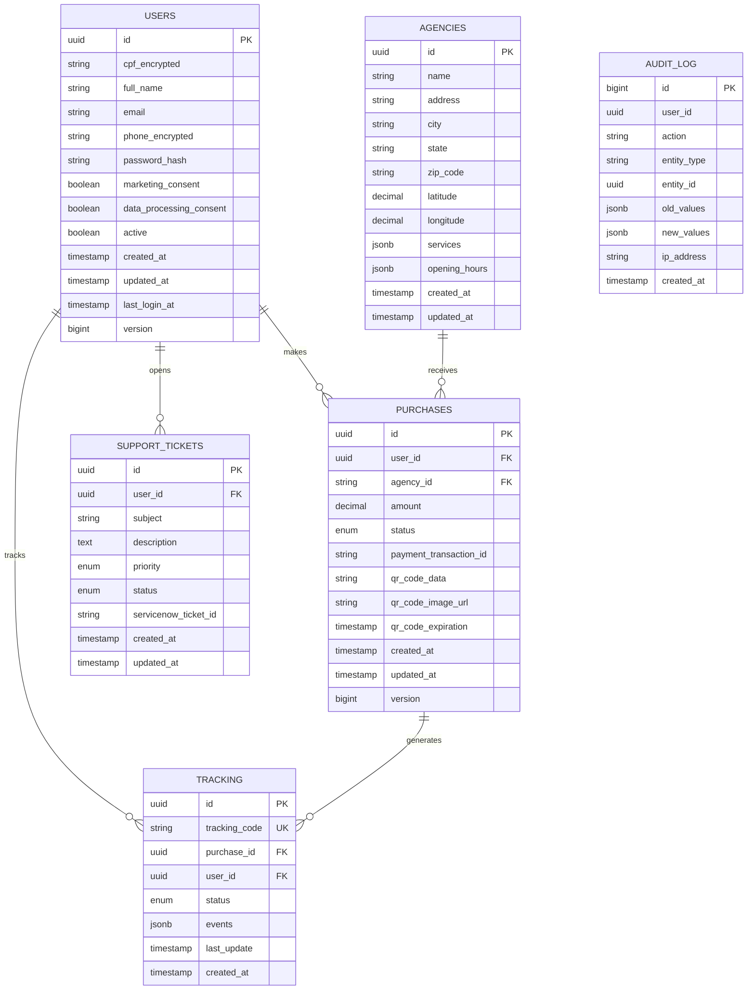

### 2. SQL DDL

```sql
-- 001_create_users_table.sql
CREATE EXTENSION IF NOT EXISTS "uuid-ossp";
CREATE EXTENSION IF NOT EXISTS "pgcrypto";

CREATE TABLE users (
    id UUID PRIMARY KEY DEFAULT uuid_generate_v4(),
    cpf_encrypted TEXT NOT NULL,
    full_name VARCHAR(100) NOT NULL,
    email VARCHAR(255) NOT NULL,
    phone_encrypted TEXT NOT NULL,
    password_hash VARCHAR(255) NOT NULL,
    marketing_consent BOOLEAN NOT NULL DEFAULT FALSE,
    data_processing_consent BOOLEAN NOT NULL DEFAULT FALSE,
    active BOOLEAN NOT NULL DEFAULT TRUE,
    created_at TIMESTAMP WITH TIME ZONE DEFAULT CURRENT_TIMESTAMP,
    updated_at TIMESTAMP WITH TIME ZONE DEFAULT CURRENT_TIMESTAMP,
    last_login_at TIMESTAMP WITH TIME ZONE,
    version BIGINT DEFAULT 0,
    
    CONSTRAINT uq_user_cpf UNIQUE (cpf_encrypted),
    CONSTRAINT uq_user_email UNIQUE (email)
);

CREATE INDEX idx_users_email ON users(email);
CREATE INDEX idx_users_active ON users(active) WHERE active = TRUE;

-- Trigger para atualizar updated_at
CREATE OR REPLACE FUNCTION update_updated_at_column()
RETURNS TRIGGER AS $$
BEGIN
    NEW.updated_at = CURRENT_TIMESTAMP;
    NEW.version = OLD.version + 1;
    RETURN NEW;
END;
$$ language 'plpgsql';

CREATE TRIGGER update_users_updated_at 
    BEFORE UPDATE ON users 
    FOR EACH ROW 
    EXECUTE FUNCTION update_updated_at_column();

-- 002_create_purchases_table.sql
CREATE TYPE purchase_status AS ENUM (
    'PENDING', 
    'PAYMENT_PROCESSING', 
    'PAYMENT_CONFIRMED', 
    'QR_CODE_GENERATED', 
    'COMPLETED', 
    'FAILED', 
    'REFUNDED'
);

CREATE TABLE purchases (
    id UUID PRIMARY KEY DEFAULT uuid_generate_v4(),
    user_id UUID NOT NULL REFERENCES users(id),
    agency_id UUID NOT NULL,
    amount DECIMAL(10, 2) NOT NULL CHECK (amount > 0),
    status purchase_status NOT NULL DEFAULT 'PENDING',
    payment_transaction_id VARCHAR(100),
    qr_code_data TEXT,
    qr_code_image_url TEXT,
    qr_code_expiration TIMESTAMP WITH TIME ZONE,
    created_at TIMESTAMP WITH TIME ZONE DEFAULT CURRENT_TIMESTAMP,
    updated_at TIMESTAMP WITH TIME ZONE DEFAULT CURRENT_TIMESTAMP,
    version BIGINT DEFAULT 0,
    
    CONSTRAINT uq_qr_code UNIQUE (qr_code_data)
);

CREATE INDEX idx_purchases_user_id ON purchases(user_id);
CREATE INDEX idx_purchases_status ON purchases(status);
CREATE INDEX idx_purchases_created_at ON purchases(created_at DESC);
CREATE INDEX idx_purchases_qr_expiration ON purchases(qr_code_expiration) 
    WHERE status = 'COMPLETED';

CREATE TRIGGER update_purchases_updated_at 
    BEFORE UPDATE ON purchases 
    FOR EACH ROW 
    EXECUTE FUNCTION update_updated_at_column();

-- 003_create_agencies_table.sql
CREATE TABLE agencies (
    id UUID PRIMARY KEY DEFAULT uuid_generate_v4(),
    name VARCHAR(200) NOT NULL,
    address TEXT NOT NULL,
    city VARCHAR(100) NOT NULL,
    state CHAR(2) NOT NULL,
    zip_code VARCHAR(8) NOT NULL,
    latitude DECIMAL(10, 8) NOT NULL,
    longitude DECIMAL(11, 8) NOT NULL,
    services JSONB DEFAULT '[]',
    opening_hours JSONB DEFAULT '{}',
    phone VARCHAR(20),
    email VARCHAR(255),
    active BOOLEAN DEFAULT TRUE,
    created_at TIMESTAMP WITH TIME ZONE DEFAULT CURRENT_TIMESTAMP,
    updated_at TIMESTAMP WITH TIME ZONE DEFAULT CURRENT_TIMESTAMP,
    
    CONSTRAINT chk_latitude CHECK (latitude BETWEEN -90 AND 90),
    CONSTRAINT chk_longitude CHECK (longitude BETWEEN -180 AND 180)
);

-- Índice geoespacial
CREATE INDEX idx_agencies_location ON agencies 
    USING GIST (point(longitude, latitude));

CREATE INDEX idx_agencies_city_state ON agencies(city, state);
CREATE INDEX idx_agencies_active ON agencies(active) WHERE active = TRUE;

-- 004_create_tracking_table.sql
CREATE TYPE tracking_status AS ENUM (
    'POSTADO',
    'EM_TRANSITO',
    'SAIU_ENTREGA',
    'ENTREGUE',
    'EXTRAVIO',
    'DEVOLVIDO'
);

CREATE TABLE tracking (
    id UUID PRIMARY KEY DEFAULT uuid_generate_v4(),
    tracking_code VARCHAR(13) UNIQUE NOT NULL,
    purchase_id UUID REFERENCES purchases(id),
    user_id UUID REFERENCES users(id),
    status tracking_status DEFAULT 'POSTADO',
    events JSONB DEFAULT '[]',
    last_update TIMESTAMP WITH TIME ZONE,
    created_at TIMESTAMP WITH TIME ZONE DEFAULT CURRENT_TIMESTAMP,
    expires_at TIMESTAMP WITH TIME ZONE DEFAULT (CURRENT_TIMESTAMP + INTERVAL '90 days')
);

CREATE INDEX idx_tracking_code ON tracking(tracking_code);
CREATE INDEX idx_tracking_user ON tracking(user_id);
CREATE INDEX idx_tracking_expires ON tracking(expires_at);

-- 005_create_support_tickets_table.sql
CREATE TYPE ticket_priority AS ENUM ('LOW', 'MEDIUM', 'HIGH', 'URGENT');
CREATE TYPE ticket_status AS ENUM ('OPEN', 'IN_PROGRESS', 'WAITING', 'RESOLVED', 'CLOSED');

CREATE TABLE support_tickets (
    id UUID PRIMARY KEY DEFAULT uuid_generate_v4(),
    user_id UUID NOT NULL REFERENCES users(id),
    subject VARCHAR(200) NOT NULL,
    description TEXT NOT NULL,
    priority ticket_priority DEFAULT 'MEDIUM',
    status ticket_status DEFAULT 'OPEN',
    servicenow_ticket_id VARCHAR(50),
    metadata JSONB DEFAULT '{}',
    created_at TIMESTAMP WITH TIME ZONE DEFAULT CURRENT_TIMESTAMP,
    updated_at TIMESTAMP WITH TIME ZONE DEFAULT CURRENT_TIMESTAMP,
    resolved_at TIMESTAMP WITH TIME ZONE
);

CREATE INDEX idx_tickets_user ON support_tickets(user_id);
CREATE INDEX idx_tickets_status ON support_tickets(status);
CREATE INDEX idx_tickets_servicenow ON support_tickets(servicenow_ticket_id);

-- 006_create_audit_log_table.sql
CREATE TABLE audit_log (
    id BIGSERIAL PRIMARY KEY,
    user_id UUID REFERENCES users(id),
    action VARCHAR(50) NOT NULL,
    entity_type VARCHAR(50) NOT NULL,
    entity_id UUID,
    old_values JSONB,
    new_values JSONB,
    ip_address INET,
    user_agent TEXT,
    created_at TIMESTAMP WITH TIME ZONE DEFAULT CURRENT_TIMESTAMP
) PARTITION BY RANGE (created_at);

-- Partição inicial
CREATE TABLE audit_log_2024 PARTITION OF audit_log
    FOR VALUES FROM ('2024-01-01') TO ('2025-01-01');

CREATE INDEX idx_audit_user ON audit_log(user_id);
CREATE INDEX idx_audit_entity ON audit_log(entity_type, entity_id);
CREATE INDEX idx_audit_created ON audit_log(created_at DESC);

-- 007_create_functions.sql
-- Função para anonimização LGPD
CREATE OR REPLACE FUNCTION anonymize_user(user_uuid UUID)
RETURNS VOID AS $$
BEGIN
    UPDATE users 
    SET 
        cpf_encrypted = 'ANONYMIZED',
        full_name = 'Usuário Removido',
        email = 'removed_' || id || '@anonymized.com',
        phone_encrypted = 'ANONYMIZED',
        password_hash = 'ANONYMIZED',
        active = FALSE,
        updated_at = CURRENT_TIMESTAMP
    WHERE id = user_uuid;
    
    -- Remove dados pessoais de compras
    UPDATE purchases 
    SET qr_code_data = NULL 
    WHERE user_id = user_uuid;
    
    -- Log da operação
    INSERT INTO audit_log (action, entity_type, entity_id, new_values)
    VALUES ('ANONYMIZE', 'USER', user_uuid, '{"reason": "LGPD_REQUEST"}'::jsonb);
END;
$$ LANGUAGE plpgsql;
```

### 3. Migrations (Flyway)

```java
// shared/infrastructure/src/main/resources/db/migration/V1__Initial_schema.sql
-- Habilita extensões necessárias
CREATE EXTENSION IF NOT EXISTS "uuid-ossp";
CREATE EXTENSION IF NOT EXISTS "pgcrypto";
CREATE EXTENSION IF NOT EXISTS "postgis";

-- Função utilitária para updated_at
CREATE OR REPLACE FUNCTION update_updated_at_column()
RETURNS TRIGGER AS $$
BEGIN
    NEW.updated_at = CURRENT_TIMESTAMP;
    IF TG_OP = 'UPDATE' THEN
        NEW.version = COALESCE(OLD.version, 0) + 1;
    END IF;
    RETURN NEW;
END;
$$ language 'plpgsql';
```

## Segurança

### 1. Configuração Keycloak

```json
{
  "realm": "correios",
  "enabled": true,
  "sslRequired": "external",
  "registrationAllowed": false,
  "loginWithEmailAllowed": true,
  "duplicateEmailsAllowed": false,
  "resetPasswordAllowed": true,
  "editUsernameAllowed": false,
  "bruteForceProtected": true,
  "permanentLockout": false,
  "maxFailureWaitSeconds": 900,
  "minimumQuickLoginWaitSeconds": 60,
  "waitIncrementSeconds": 60,
  "quickLoginCheckMilliSeconds": 1000,
  "maxDeltaTimeSeconds": 43200,
  "failureFactor": 5,
  "roles": {
    "realm": [
      {
        "name": "USER",
        "description": "Usuário padrão do aplicativo"
      },
      {
        "name": "ADMIN",
        "description": "Administrador do sistema"
      },
      {
        "name": "ATTENDANT",
        "description": "Atendente de agência"
      }
    ]
  },
  "clients": [
    {
      "clientId": "correios-mobile",
      "enabled": true,
      "clientAuthenticatorType": "client-secret",
      "secret": "mobile-secret-key",
      "redirectUris": ["com.correios.app://*"],
      "webOrigins": ["*"],
      "notBefore": 0,
      "bearerOnly": false,
      "consentRequired": false,
      "standardFlowEnabled": true,
      "implicitFlowEnabled": false,
      "directAccessGrantsEnabled": true,
      "serviceAccountsEnabled": false,
      "publicClient": false,
      "frontchannelLogout": false,
      "protocol": "openid-connect",
      "attributes": {
        "access.token.lifespan": "300",
        "refresh.token.lifespan": "1800"
      },
      "fullScopeAllowed": true
    }
  ]
}
```

### 2. Configuração Kong (OIDC + Rate Limiting)

```yaml
# kong.yml
_format_version: "3.0"

services:
  - name: identity-service
    url: http://identity-service:8080
    routes:
      - name: identity-routes
        paths:
          - /api/v1/identity
        strip_path: false
    plugins:
      - name: rate-limiting
        config:
          minute: 10
          policy: redis
          redis_host: redis
          fault_tolerant: true
          hide_client_headers: false

  - name: purchase-service
    url: http://purchase-service:8080
    routes:
      - name: purchase-routes
        paths:
          - /api/v1/purchases
        strip_path: false
    plugins:
      - name: jwt
        config:
          uri_param_names: []
          cookie_names: []
          key_claim_name: iss
          secret_is_base64: false
          claims_to_verify:
            - exp
      - name: rate-limiting
        config:
          minute: 5
          policy: redis
          redis_host: redis

  - name: tracking-service
    url: http://tracking-service:8080
    routes:
      - name: tracking-routes
        paths:
          - /api/v1/tracking
        strip_path: false
    plugins:
      - name: jwt
      - name: rate-limiting
        config:
          minute: 30

consumers:
  - username: correios-mobile
    jwt_secrets:
      - algorithm: RS256
        rsa_public_key: |
          -----BEGIN PUBLIC KEY-----
          MIIBIjANBgkqhkiG9w0BAQEFAAOCAQ8AMIIBCgKCAQEA...
          -----END PUBLIC KEY-----
        key: "correios-mobile-key"
```

### 3. Políticas de Segurança

```yaml
# security-policies.yml
password_policy:
  min_length: 8
  require_uppercase: true
  require_lowercase: true
  require_numbers: true
  require_special_chars: true
  max_age_days: 90
  prevent_reuse_count: 5

session_policy:
  access_token_ttl: 300  # 5 minutos
  refresh_token_ttl: 1800  # 30 minutos
  absolute_timeout: 28800  # 8 horas
  concurrent_sessions: 1

encryption:
  algorithm: AES-256-GCM
  key_rotation_days: 90
  at_rest: true
  in_transit: true
  tls_version: "1.3"

audit:
  enabled: true
  log_retention_days: 2555  # 7 anos (LGPD)
  sensitive_fields:
    - password
    - credit_card
    - cpf
  mask_patterns:
    cpf: "***.###.###-**"
    credit_card: "****-****-****-####"

rate_limiting:
  tiers:
    anonymous:
      requests_per_minute: 5
      requests_per_hour: 50
    authenticated:
      requests_per_minute: 30
      requests_per_hour: 1000
    premium:
      requests_per_minute: 60
      requests_per_hour: 5000

cors:
  allowed_origins:
    - "https://app.correios.com.br"
    - "https://admin.correios.com.br"
  allowed_methods:
    - GET
    - POST
    - PUT
    - DELETE
    - OPTIONS
  allowed_headers:
    - Authorization
    - Content-Type
    - X-Request-ID
  max_age: 86400
  allow_credentials: true
```

## Observabilidade

### Configuração OpenTelemetry Collector

```yaml
# otel-collector-config.yml
receivers:
  otlp:
    protocols:
      grpc:
        endpoint: 0.0.0.0:4317
      http:
        endpoint: 0.0.0.0:4318

processors:
  batch:
    timeout: 1s
    send_batch_size: 1024
  
  resource:
    attributes:
      - key: service.namespace
        value: correios
        action: upsert
      - key: deployment.environment
        value: production
        action: upsert

  filter:
    metrics:
      include:
        match_type: regexp
        metric_names:
          - http_server_.*
          - http_client_.*
          - jvm_.*
          - process_.*

exporters:
  prometheusremotewrite:
    endpoint: http://prometheus:9090/api/v1/write
    tls:
      insecure: true

  prometheus:
    endpoint: "0.0.0.0:8889"
    namespace: correios

  logging:
    loglevel: debug

  otlp/cloudwatch:
    endpoint: logs.us-east-1.amazonaws.com
    headers:
      X-Amz-Log-Group: /correios/application

  otlp/datadog:
    endpoint: intake.opentelemetry.datadoghq.com:443
    headers:
      DD-API-KEY: ${DATADOG_API_KEY}

service:
  pipelines:
    traces:
      receivers: [otlp]
      processors: [resource, batch]
      exporters: [logging, otlp/datadog]
    
    metrics:
      receivers: [otlp]
      processors: [filter, resource, batch]
      exporters: [prometheus, prometheusremotewrite, otlp/datadog]
    
    logs:
      receivers: [otlp]
      processors: [resource, batch]
      exporters: [logging, otlp/cloudwatch]
```

### 2. Dashboard Grafana

```json
{
  "dashboard": {
    "title": "Correios - Visão Geral",
    "tags": ["correios", "production"],
    "timezone": "America/Sao_Paulo",
    "panels": [
      {
        "id": 1,
        "title": "Taxa de Requisições",
        "type": "stat",
        "targets": [
          {
            "expr": "sum(rate(http_server_requests_seconds_count[5m]))",
            "legendFormat": "req/s"
          }
        ],
        "gridPos": { "h": 8, "w": 12, "x": 0, "y": 0 }
      },
      {
        "id": 2,
        "title": "Latência P95",
        "type": "graph",
        "targets": [
          {
            "expr": "histogram_quantile(0.95, sum(rate(http_server_requests_seconds_bucket[5m])) by (le))",
            "legendFormat": "P95"
          }
        ],
        "gridPos": { "h": 8, "w": 12, "x": 12, "y": 0 }
      },
      {
        "id": 3,
        "title": "Taxa de Erro",
        "type": "stat",
        "targets": [
          {
            "expr": "sum(rate(http_server_requests_seconds_count{status=~\"5..\"}[5m])) / sum(rate(http_server_requests_seconds_count[5m]))",
            "legendFormat": "Error Rate"
          }
        ],
        "gridPos": { "h": 8, "w": 8, "x": 0, "y": 8 }
      },
      {
        "id": 4,
        "title": "Compras por Minuto",
        "type": "graph",
        "targets": [
          {
            "expr": "sum(rate(purchase_completed_total[1m]))",
            "legendFormat": "Compras"
          }
        ],
        "gridPos": { "h": 8, "w": 8, "x": 8, "y": 8 }
      },
      {
        "id": 5,
        "title": "Cache Hit Ratio",
        "type": "gauge",
        "targets": [
          {
            "expr": "redis_keyspace_hits / (redis_keyspace_hits + redis_keyspace_misses)",
            "legendFormat": "Hit Ratio"
          }
        ],
        "gridPos": { "h": 8, "w": 8, "x": 16, "y": 8 }
      }
    ]
  }
}
```

### 3. Health Checks

```java
// shared/infrastructure/src/main/java/com/correios/shared/health/HealthConfig.java
package com.correios.shared.health;

import org.springframework.boot.actuate.health.Health;
import org.springframework.boot.actuate.health.HealthIndicator;
import org.springframework.context.annotation.Bean;
import org.springframework.context.annotation.Configuration;
import org.springframework.data.redis.connection.RedisConnectionFactory;
import org.springframework.kafka.core.KafkaAdmin;

import javax.sql.DataSource;
import java.sql.Connection;
import java.sql.SQLException;

@Configuration
public class HealthConfig {

    @Bean
    public HealthIndicator databaseHealth(DataSource dataSource) {
        return () -> {
            try (Connection conn = dataSource.getConnection()) {
                if (conn.isValid(1)) {
                    return Health.up()
                            .withDetail("database", "PostgreSQL")
                            .withDetail("validationQuery", "SELECT 1")
                            .build();
                }
            } catch (SQLException e) {
                return Health.down()
                        .withException(e)
                        .build();
            }
            return Health.down().build();
        };
    }

    @Bean
    public HealthIndicator redisHealth(RedisConnectionFactory connectionFactory) {
        return () -> {
            try {
                var connection = connectionFactory.getConnection();
                var info = connection.serverCommands().info();
                return Health.up()
                        .withDetail("redis_version", info.getProperty("redis_version"))
                        .withDetail("used_memory", info.getProperty("used_memory_human"))
                        .build();
            } catch (Exception e) {
                return Health.down().withException(e).build();
            }
        };
    }

    @Bean
    public HealthIndicator kafkaHealth(KafkaAdmin kafkaAdmin) {
        return () -> {
            try {
                var clusterId = kafkaAdmin.describeCluster().clusterId().get();
                return Health.up()
                        .withDetail("cluster_id", clusterId)
                        .build();
            } catch (Exception e) {
                return Health.down().withException(e).build();
            }
        };
    }
}
```

## Automação

### 1. GitHub Actions CI/CD

```yaml
# .github/workflows/ci-cd.yml
name: CI/CD Pipeline

on:
  push:
    branches: [main, develop]
  pull_request:
    branches: [main]

jobs:
  test:
    runs-on: ubuntu-latest
    services:
      postgres:
        image: postgres:15
        env:
          POSTGRES_PASSWORD: postgres
        options: >-
          --health-cmd pg_isready
          --health-interval 10s
          --health-timeout 5s
          --health-retries 5
        ports:
          - 5432:5432
      redis:
        image: redis:7
        ports:
          - 6379:6379

    steps:
      - uses: actions/checkout@v4
      
      - name: Set up JDK 17
        uses: actions/setup-java@v3
        with:
          java-version: '17'
          distribution: 'temurin'
          cache: maven

      - name: Run Tests
        run: |
          cd services/identity-service && ./mvnw test
          cd ../catalog-service && ./mvnw test
          cd ../purchase-service && ./mvnw test

      - name: SonarQube Scan
        uses: SonarSource/sonarqube-scan-action@master
        env:
          SONAR_TOKEN: ${{ secrets.SONAR_TOKEN }}

  build:
    needs: test
    runs-on: ubuntu-latest
    strategy:
      matrix:
        service: [identity-service, catalog-service, purchase-service, tracking-service, support-service, adapter-cloudfoundry]
    
    steps:
      - uses: actions/checkout@v4
      
      - name: Build Docker Image
        run: |
          docker build -t correios/${{ matrix.service }}:${{ github.sha }} ./services/${{ matrix.service }}
          docker tag correios/${{ matrix.service }}:${{ github.sha }} correios/${{ matrix.service }}:latest

      - name: Push to Registry
        if: github.ref == 'refs/heads/main'
        run: |
          echo ${{ secrets.DOCKER_PASSWORD }} | docker login -u ${{ secrets.DOCKER_USERNAME }} --password-stdin
          docker push correios/${{ matrix.service }}:${{ github.sha }}
          docker push correios/${{ matrix.service }}:latest

  deploy-staging:
    needs: build
    if: github.ref == 'refs/heads/develop'
    runs-on: ubuntu-latest
    environment: staging
    
    steps:
      - name: Deploy to Staging
        run: |
          echo "Deploying to staging environment..."
          # kubectl apply -f k8s/staging/

  deploy-production:
    needs: build
    if: github.ref == 'refs/heads/main'
    runs-on: ubuntu-latest
    environment: production
    
    steps:
      - name: Deploy to Production
        run: |
          echo "Deploying to production environment..."
          # kubectl apply -f k8s/production/
```

### 2. Scripts de Utilidade

```bash
#!/bin/bash
# scripts/setup-local.sh

set -e

echo "Configurando ambiente de desenvolvimento local..."

# Verifica dependências
command -v docker >/dev/null 2>&1 || { echo "Docker não instalado"; exit 1; }
command -v docker-compose >/dev/null 2>&1 || { echo "Docker Compose não instalado"; exit 1; }

# Cria .env se não existir
if [ ! -f .env ]; then
    cp .env.example .env
    echo "Arquivo .env criado. Por favor, configure suas variáveis."
fi

# Inicia infraestrutura
echo "Iniciando infraestrutura..."
docker-compose up -d postgres redis zookeeper kafka elasticsearch keycloak

# Aguarda serviços
echo "Aguardando serviços ficarem prontos..."
sleep 30

# Executa migrations
echo "Executando migrations..."
docker-compose exec postgres psql -U correios -d correios_db -f /docker-entrypoint-initdb.d/001_create_users_table.sql

# Inicia serviços
echo "Iniciando serviços..."
docker-compose up -d --build

echo "Ambiente configurado com sucesso!"
echo ""
echo "URLs disponíveis:"
echo "  Kong Gateway: http://localhost:8000"
echo "  Keycloak: http://localhost:8180 (admin/admin123)"
echo "  Kafka UI: http://localhost:8080"
echo "  Grafana: http://localhost:3000 (admin/admin123)"
echo ""
echo "Para iniciar o app mobile:"
echo "  cd correios-mobile && npm install && npm start"
```

## Roadmap Técnico

### Fase 1: MVP (Meses 1-3)

 - [x] Arquitetura base implementada
 - [x] Serviço de Identidade com LGPD
 - [x] Serviço de Catálogo com geolocalização
 - [x] Serviço de Compra com Saga Pattern
 - [x] Cache offline-first no mobile
 - [x] Observabilidade básica

### Fase 2: Escala e Resiliência (Meses 4-6)

 - [ ] Implementar sharding no PostgreSQL
 - [ ] Cluster Redis com Sentinel
 - [ ] Kafka com múltiplos brokers e MirrorMaker
 - [ ] Circuit Breaker em todas as integrações
 - [ ] Cache distribuído com Hazelcast
 - [ ] Rate limiting por usuário (Redis Cell)

### Fase 3: Compliance e Segurança (Meses 7-9)

 - [ ] Certificação PCIDSS nível 1
 - [ ] Auditoria completa LGPD
 - [ ] Criptografia de dados em repouso (TDE)
 - [ ] WAF (Web Application Firewall)
 - [ ] DLP (Data Loss Prevention)
 - [ ] SIEM integration

### Fase 4: Evolução e Inovação (Meses 10-12)
 - [ ] Machine Learning para detecção de fraudes
 - [ ] Chatbot com NLP para suporte
 - [ ] Previsão de entregas com ML
 - [ ] Blockchain para rastreabilidade
 - [ ] Multi-tenancy para franquias
 - [ ] API Gateway GraphQL (Apollo Federation)

## Métricas de Sucesso

| Métrica         | Target Atual | Target 6 meses | Target 12 meses |
| --------------- | ------------ | -------------- | --------------- |
| Latência P95    | < 200ms      | < 100ms        | < 50ms          |
| Disponibilidade | 99.9%        | 99.95%         | 99.99%          |
| Cache Hit Ratio | 80%          | 90%            | 95%             |
| Erros 5xx       | < 0.1%       | < 0.05%        | < 0.01%         |
| Tempo de Deploy | 30 min       | 15 min         | 5 min           |
| RTO (Recovery)  | 1 hora       | 30 min         | 15 min          |
| RPO (Data Loss) | 5 min        | 1 min          | 0 (síncrono)    |


