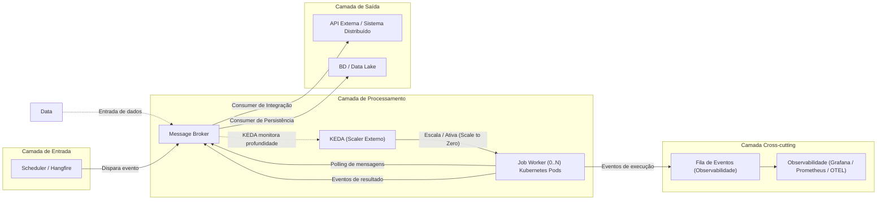
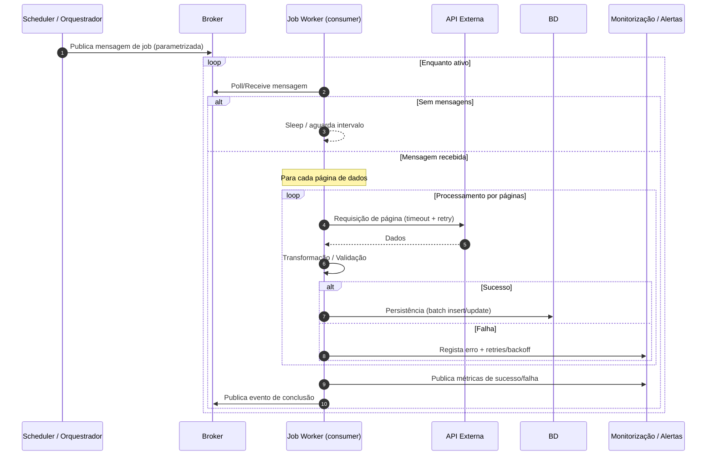
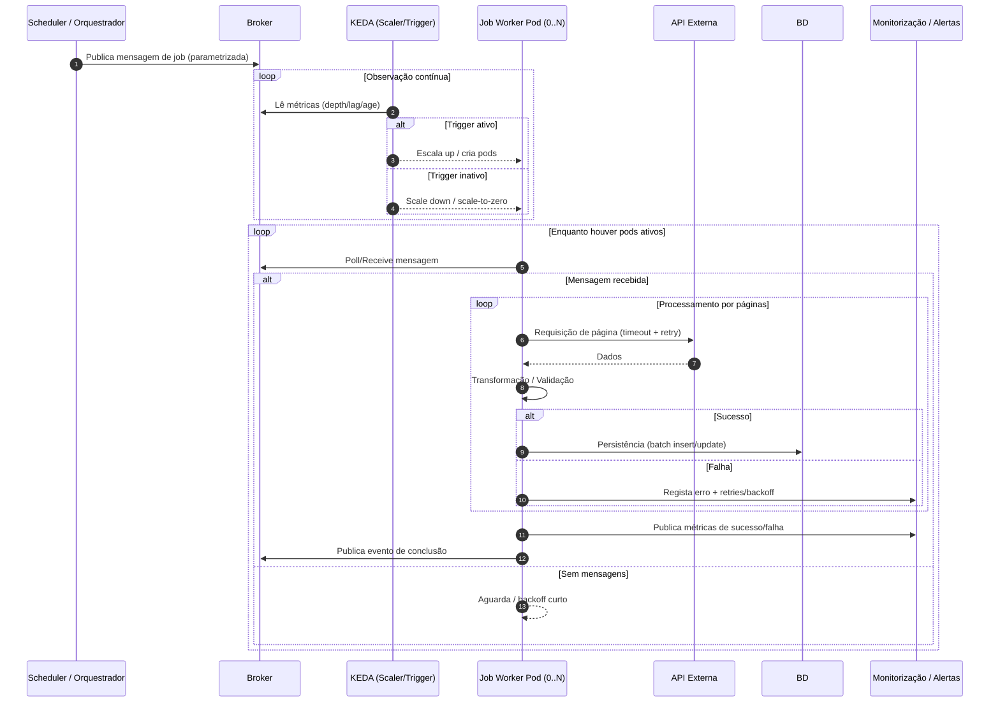
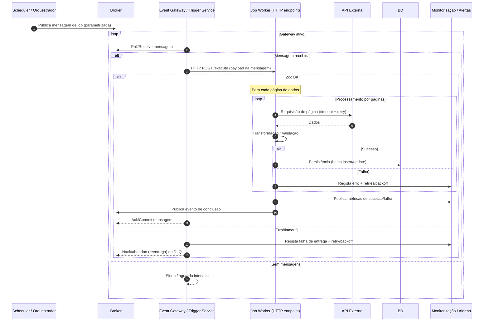

Índice
------

- [Apoio DAS Batch Job Worker — Diagramas e Exemplos de Implementação](#apoio-das-batch-job-worker-diagramas-e-exemplos-de-implementação)
    - [4.2 Diagrama de Arquitetura Lógica](#42-diagrama-de-arquitetura-lógica)
    - [4.3 Diagramas de Sequência Detalhados](#43-diagramas-de-sequência-detalhados)
        - [4.3.1 Scenario 1 — Legacy 1 (pull/polling direto pelo Job Worker)](#431-scenario-1-legacy-1-pullpolling-direto-pelo-job-worker)
        - [4.3.2 Scenario 2 — Ideal (KEDA escala pods; worker faz polling)](#432-scenario-2-ideal-keda-escala-pods-worker-faz-polling)
        - [4.3.3 Scenario 3 — Legacy 2 (Event Gateway faz "push" para endpoint HTTP do worker)](#433-scenario-3-legacy-2-event-gateway-faz-push-para-endpoint-http-do-worker)
    - [Exemplo de Implementação do Hangfire](#exemplo-de-implementação-do-hangfire)
        - [Abstração recomendada (Application)](#abstração-recomendada-application)
        - [Implementação com Hangfire (Infrastructure)](#implementação-com-hangfire-infrastructure)
        - [Registro no IoC (Infrastructure)](#registro-no-ioc-infrastructure)
        - [Uso a partir da Application](#uso-a-partir-da-application)
        - [Cancelamento em Jobs de Longa Duração](#cancelamento-em-jobs-de-longa-duração)
        - [Checkpointing e Gestão de Estado entre Reexecuções](#checkpointing-e-gestão-de-estado-entre-reexecuções)
    - [Monitorização de Filas Hangfire](#monitorização-de-filas-hangfire)
        - [Isolamento em Testes de Integração com Hangfire](#isolamento-em-testes-de-integração-com-hangfire)

# Apoio DAS Batch Job Worker — Diagramas e Exemplos de Implementação

---

## 4.2 Diagrama de Arquitetura Lógica

O diagrama abaixo ilustra as quatro camadas da arquitetura de referência. Observabilidade e Resiliência são *cross-cutting concerns* transversais a todas as camadas, e não uma etapa isolada no fluxo de processamento.



---

## 4.3 Diagramas de Sequência Detalhados

> **Semântica de Entrega (todos os cenários):**
> - *at-least-once* (normal em mensageria) + idempotência obrigatória no worker.

> **Garantias de Entrega e Idempotência:** A semântica *at-least-once* implica que um mesmo evento pode ser processado mais de uma vez. Por isso, **idempotência é obrigatória em todos os workers**: cada unidade de trabalho deve ser identificável por um `eventId`/`correlationId` único, com registo de deduplicação, garantindo que reprocessamentos não produzam efeitos duplicados.

### 4.3.1 Scenario 1 — Legacy 1 (pull/polling direto pelo Job Worker)

**Descrição do fluxo:** o Scheduler publica uma mensagem no Broker; o Job Worker, que está sempre ativo, faz polling contínuo. Ao receber a mensagem, processa os dados por páginas — chamando a API externa com retry/timeout, transformando e persistindo em BD — e publica métricas e evento de conclusão no final.



---

### 4.3.2 Scenario 2 — Ideal (KEDA escala pods; worker faz polling)

**Descrição do fluxo:** o Scheduler publica a mensagem no Broker; o KEDA monitoriza continuamente a profundidade/lag da fila e escala os pods do Job Worker conforme os thresholds configurados (incluindo scale-to-zero). Os pods ativos fazem polling ao Broker e processam as mensagens por páginas, publicando métricas e evento de conclusão.

> **Nota importante:** O worker continua a fazer poll ao broker. KEDA não entrega a mensagem — decide escalar com base em métricas de fila (depth/lag/age).



---

### 4.3.3 Scenario 3 — Legacy 2 (Event Gateway faz "push" para endpoint HTTP do worker)

**Descrição do fluxo:** o Scheduler publica a mensagem no Broker; o Event Gateway faz polling e entrega via HTTP POST ao endpoint do worker legado. Em caso de sucesso (2xx), o worker processa por páginas e o Gateway faz ACK no Broker. Em caso de erro ou timeout, o Gateway regista a falha, aplica retry/backoff e pode mover para DLQ.



---

## Exemplo de Implementação do Hangfire

Hangfire é um detalhe de infraestrutura:

- A camada de Application **nunca** deve depender diretamente de Hangfire
- Expor uma interface (ex.: `IBackgroundJobScheduler`) na Application/Domain
- Implementar essa interface na Infrastructure usando Hangfire

Desta forma:

- A arquitetura continua limpa (DDD / Clean Architecture)
- O domínio e a Application apenas "pedem" um job em background
- A Infrastructure decide *como* executar (Hangfire, Quartz, Worker Service, etc.)
- Fica fácil trocar a tecnologia no futuro, se necessário, sem quebrar o contrato interno

> **⚠️ Concorrência e Idempotência:** Em ambientes com múltiplas instâncias do worker ou reexecuções automáticas, jobs podem ser processados em paralelo. Para garantir idempotência, use uma chave única por `jobId` + parâmetros e registe o estado de execução antes de iniciar o processamento. Para jobs críticos que não tolerem execução paralela, implemente locking distribuído (ex.: Redis Distributed Lock ou registo de estado na BD com `SELECT FOR UPDATE`).

### Abstração recomendada (Application)

```csharp
namespace Modelo.Application.Interfaces;

public interface IBackgroundJobScheduler
{
    string Enqueue(Expression<Func<Task>> methodCall);
    void Schedule(Expression<Func<Task>> methodCall, TimeSpan delay);
    void ScheduleRecurring(string jobId, string cronExpression, Expression<Func<Task>> methodCall);
}
```

### Implementação com Hangfire (Infrastructure)

```csharp
using Hangfire;
using Modelo.Application.Interfaces;
using System.Linq.Expressions;

namespace Modelo.Infrastructure.BackgroundJobs;

public sealed class HangfireBackgroundJobScheduler : IBackgroundJobScheduler
{
    private readonly IBackgroundJobClient _backgroundJobs;
    private readonly IRecurringJobManager _recurringJobs;

    public HangfireBackgroundJobScheduler(
        IBackgroundJobClient backgroundJobs,
        IRecurringJobManager recurringJobs)
    {
        _backgroundJobs = backgroundJobs;
        _recurringJobs = recurringJobs;
    }

    public string Enqueue(Expression<Func<Task>> methodCall)
        => _backgroundJobs.Enqueue(methodCall);

    public void Schedule(Expression<Func<Task>> methodCall, TimeSpan delay)
        => _backgroundJobs.Schedule(methodCall, delay);

    public void ScheduleRecurring(string jobId, string cronExpression, Expression<Func<Task>> methodCall)
        => _recurringJobs.AddOrUpdate(jobId, methodCall, cronExpression);
}
```

### Registro no IoC (Infrastructure)

```csharp
services.AddSingleton<IBackgroundJobScheduler, HangfireBackgroundJobScheduler>();
```

### Uso a partir da Application

```csharp
public class FaturamentoAppService
{
    private readonly IBackgroundJobScheduler _jobs;

    public FaturamentoAppService(IBackgroundJobScheduler jobs)
    {
        _jobs = jobs;
    }

    public void DispararReprocessamentoMensal(int anoMes)
    {
        _jobs.Enqueue(() => ReprocessarFaturas(anoMes));
    }

    private async Task ReprocessarFaturas(int anoMes)
    {
        // lógica de aplicação/domínio aqui
    }
}
```

### Cancelamento em Jobs de Longa Duração

Jobs de longa duração devem suportar cancelamento gracioso via `CancellationToken`, especialmente em cenários de deploy, scale-down ou abort manual:

```csharp
public async Task ProcessarJobLongo(int parametro, CancellationToken cancellationToken)
{
    foreach (var chunk in ObterChunks(parametro))
    {
        cancellationToken.ThrowIfCancellationRequested();
        await ProcessarChunk(chunk, cancellationToken);
        await SalvarCheckpoint(chunk.Id, cancellationToken);
    }
}
```

> Hangfire passa automaticamente o `CancellationToken` quando o servidor é parado (`BackgroundJobServer.Dispose`). Garantir que o token é propagado a todas as chamadas I/O (BD, API externa) para que o cancelamento seja efectivo.

### Checkpointing e Gestão de Estado entre Reexecuções

Para jobs que processam grandes volumes em múltiplas execuções, é obrigatório persistir o estado de progresso (watermark/cursor) após cada chunk, permitindo retoma sem reprocessamento:

```csharp
public async Task ProcessarComCheckpoint(int anoMes, CancellationToken cancellationToken)
{
    var checkpoint = await _checkpointRepository.ObterAsync($"faturamento:{anoMes}");
    var ultimoIdProcessado = checkpoint?.UltimoId ?? 0;

    await foreach (var chunk in _repo.ObterChunksAPartirDe(ultimoIdProcessado, cancellationToken))
    {
        cancellationToken.ThrowIfCancellationRequested();
        await ProcessarChunk(chunk, cancellationToken);
        await _checkpointRepository.SalvarAsync($"faturamento:{anoMes}", chunk.UltimoId);
    }
}
```

> **Nota ilustrativa** — adaptar `_checkpointRepository`, `ObterChunksAPartirDe` e demais dependências à lógica de negócio e stack específicos do serviço.

---

## Monitorização de Filas Hangfire

Além das métricas gerais de job, workers que utilizam Hangfire devem monitorizar:

- **Jobs pendentes na fila** (`hangfire_enqueued_count`): número de jobs aguardando execução; limiar de alerta deve ser definido por equipa.
- **Jobs em falha recorrente** (`hangfire_failed_count`): jobs que falharam e não serão retentados automaticamente; valor acima de 0 deve gerar alerta imediato.
- **Tempo médio de execução por job type:** percentis p50/p95 de duração por tipo de job agendado.
- **Jobs agendados (scheduled):** jobs com disparo futuro pendente — útil para validar que crons estão a ser registados correctamente.

### Isolamento em Testes de Integração com Hangfire

Ao executar testes de integração que envolvam Hangfire, utilizar storage In-Memory e garantir que o `BackgroundJobServer` é iniciado e terminado dentro do escopo do teste, evitando interferência entre execuções. Nunca partilhar instâncias de storage Hangfire entre testes.

```csharp
// Exemplo ilustrativo — adaptar à lógica de negócio específica
public class HangfireIntegrationTests : IDisposable
{
    private readonly BackgroundJobServer _server;

    public HangfireIntegrationTests()
    {
        GlobalConfiguration.Configuration.UseInMemoryStorage();
        _server = new BackgroundJobServer();
    }

    public void Dispose() => _server.Dispose();

    [Fact]
    public async Task DeveEnqueueEExecutarJob()
    {
        // Arrange
        var jobId = BackgroundJob.Enqueue(() => Console.WriteLine("teste"));

        // Act — aguardar processamento
        await Task.Delay(500);

        // Assert — validar estado real do job (ex: persistência em BD de teste)
        var job = JobStorage.Current.GetMonitoringApi().JobDetails(jobId);
        Assert.NotNull(job);
        // substituir por asserção de negócio real (ex: verificar efeito na BD)
    }
}
```
